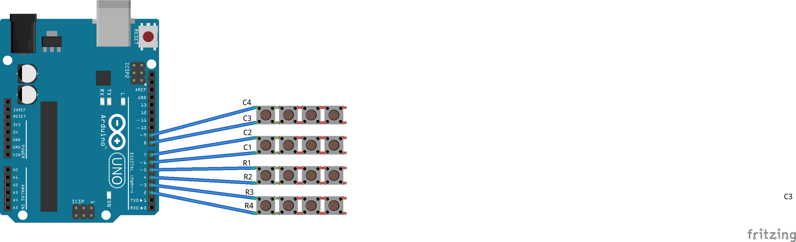

# Pogas attēlošana uz seriālās izvades

Pogu paneļa 8 izejas var pieslēgt Arduino kontaktiem 2..9. 
Tādā gadījumā, atverot **Tools > Serial Monitor** var redzēt 
izdrukātus pogu nosaukumus (0..9, A..F). 

Pogām varam piešķirt arī savas vērtības. 
Šeit izmantota bibliotēka, kura nolasa pogu vērtību. 
Tāpat kā iepriekš - katra poga ir vienkārši slēdzis. 
Arduino uzliek pārmaiņus uz katras no rindiņām spriegumu un 
mēģina atrast kolonnu, kurā šis spriegums parādās.

