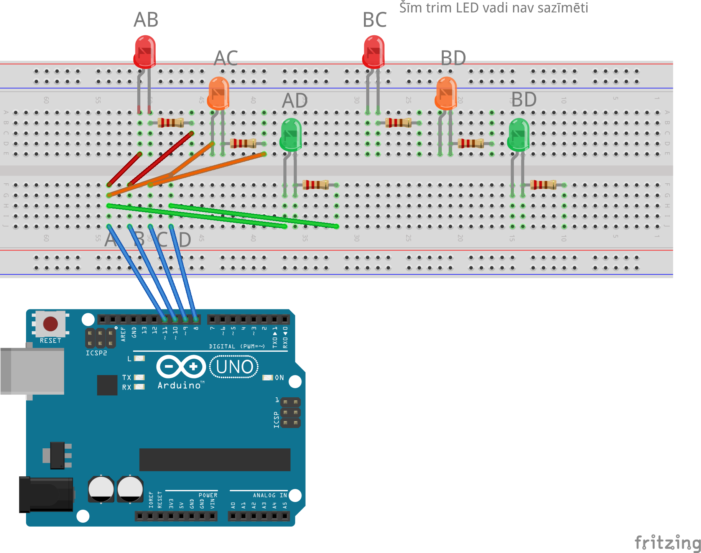

# Kombinācija pa 2 no 4

Šajā praktiskajā darbā jāizvieto 6 LED lampiņas un 
tās jākontrolē ar 4 vadiem tā, lai katru lampiņu neatkarīgi 
no citām varētu ieslēgt vai izslēgt. Pieņemam, 
ka LED lampiņas ieslēdz tikai pa vienai - nav nepieciešams, 
lai vienlaikus degtu vairākas.

Parastās elektriskās shēmās 
6 LED lampiņām, ko vajag neatkarīgi vienu no otras ieslēgt 
vai izslēgt, vajadzētu 7 vadus - pa vienam uz katru lampiņu 
un vēl arī kopīgo katodu, kas pievienots **GND**. 
(Šādi darbojas, piemēram, viena cipara displejs.)
Bet šajā darbā iedomāsimies, ka mums ir tikai 4 brīvi 
kontakti uz Arduino kontroliera nevis 6. 

Ideja, lai 6 LED lampiņas varētu kontrolēt ar 4 vadiem ir 
vispār nelietot fiksētu katodu, bet gan katrai LED lampiņai 
pievienot citu ienākošo vadu kombināciju. 
Kombinatorikā zināms, ka 2 vadiņus no 4 vadiņiem 
var izvēlēties 6 veidos:

$$C_4^2 = \frac{4!}{2!2!} = \frac{24}{2 \cdot 2} = 6.$$

Tātad, ja ienākošos 4 vadus apzīmējam ar A,B,C,D, tad 
lampiņām pieslēgto vadu kombinācijas ir šādas: 

$$\{ AB, AC, AD, BC, BD, CD \}.$$

Ņemot šo vērā, var saslēgt elektrisko shēmu, kur maketēšanas 
platei pienāk tikai 4 vadi - no kuriem neviens nav **GND** vai **5V**, 
un darbināt skriptu, kas 6 sekunžu ciklā iededz lampiņas pa vienai. 

*Piezīme:* Šajā darbā izmantojam trīs dažādus stāvokļus 
katram no četriem vadiem. Tas var būt **HIGH** (pieslēgts 5V spriegumam), 
tas var būt **LOW** (pieslēgts 0V spriegumam) vai arī tas 
var būt "floating" (tāds vads, kurš ir "brīvs" un nevienam 
neuzbāžas ar savu spriegumu). To panāk, konfigurējot vadam 
"INPUT" režīmu. 

## Uzdevumi

1. Tā kā LED lampiņām ir polaritāte, tad ir būtiski, kurai no kājiņām 
   (īsākajai vai garākajai) pieslēdz katru vadu. 
   Pieslēgums $AB$ (garākajai kājiņai vads $A$, bet īsākajai vads $B$)
   nav tas pats, kas pieslēgums $BA$ (kur vadi samainīti vietām). 
   Dažādo pieslēgumu kombināciju ir pavisam $12$. 
   Pārveidojiet elektrisko shēmu un scenāriju tā, lai neatkarīgi 
   vienu no otras varētu ieslēgt nevis $6$, bet $12$ LED lampiņas - 
   un iededziet tās 12 sekunžu ciklā pa vienai. 