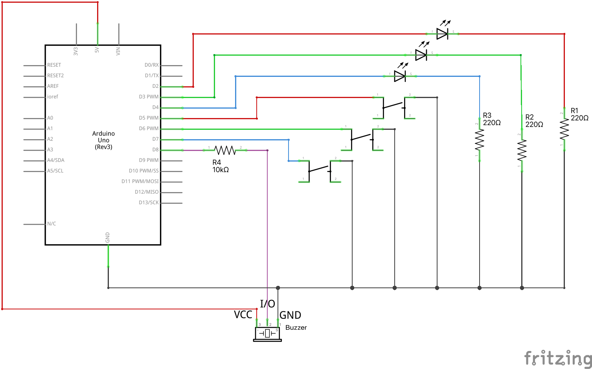

# Cilvēka reakcijas ātruma mērītājs

Ar podziņām un dažādu krāsu diodēm kā slēdžiem var izveidot ķēdi, kura 
nosaka cilvēka reakcijas ātrumu milisekundēs. Eksperimenta gaita ir šāda: 

Vienu un to pašu mērījumu atkārto 10 reizes: 

* Ik pēc 2-6 sekundēm iededz vienu gaismas diodi no trim. 
  Visas trīs diodes ir dažādās krāsās (piemēram, sarkana, zaļa, zila). 
* Lietotājs ospiež 
  atbilstošu podziņu - eksperimenta sākumā ir paziņots, kurai 
  krāsai atbilst kura podziņa. 
* Nomēra milisekundes, 
  kas pagājušas starp LED diodes iedegšanos un podziņas nospiešanu.
  Ja nospiestā podziņa neatbilst diodes krāsai, atbilstošais mērījums ir 
  500 milisekundes (tas ir lietotājam neizdevīgs rezultāts, jo parasti reakcija ir ātrāka). 
* Pēc katra mērījuma  
  reakcijas ātrumu izdrukā uz seriālā porta (vajadzēs atvērt **Serial Monitor**). 
  Ik pēc 10 mērījumiem uz seriālā porta izdrukās visu šo mērījumu 
  vidējo aritmētisko. 

*Piezīme:* Podziņu nospiešanai vislabāk lietot $4 \times 4$ podziņu matricu. 
Tā kā podziņas tur novietotas ļoti tuvu viena otrai (nepietiek vietas, lai uz 
blakus podziņām turētu dažādus pirkstus), ieteicams vajadzīgās podziņas izvietot 
pa diagonāli. Maketēšanas plaknes zīmējumā parādīts, ka oranžajai LED lampiņai 
atbilst kontakti **R1**, **C1**; zaļajai LED lampiņai kontakti **R2**, **C2**; 
zilajai LED lampiņai kontakti **R3**, **C3**. 

Elektriskā shēma: 

Maketēšanas shēma:

Lai būtu vieglāk orientēties, kad iedegta lampiņa, var ieslēgt 
pasīvo dūcēju (*passive buzzer*). Tam ir GND un VCC izejas (attiecīgi 0V un 
5V) kā arī viena I/O izeja. 
Mūsu programmā tā pievienojama pie Arduino 8.kontakta. 
Tā kā dūcējs ir ļoti skaļš, tad starp 8.kontaktu un dūcēja I/O kontaktu
ievietotas 3 ļoti lielas pretestības (pa 10 kiloomiem katra). Tās ir melnās
pretestības no mazā trauciņa.

## Vingrinājuma varianti

1. Vai iespējams Arduino scenārijā iztikt bez "INPUT_PULLUP" 
   (kontaktus 5., 6., 7. vienkārši deklarēt par "INPUT")? 
   Kas būtu jāmaina elektriskajā shēmā?