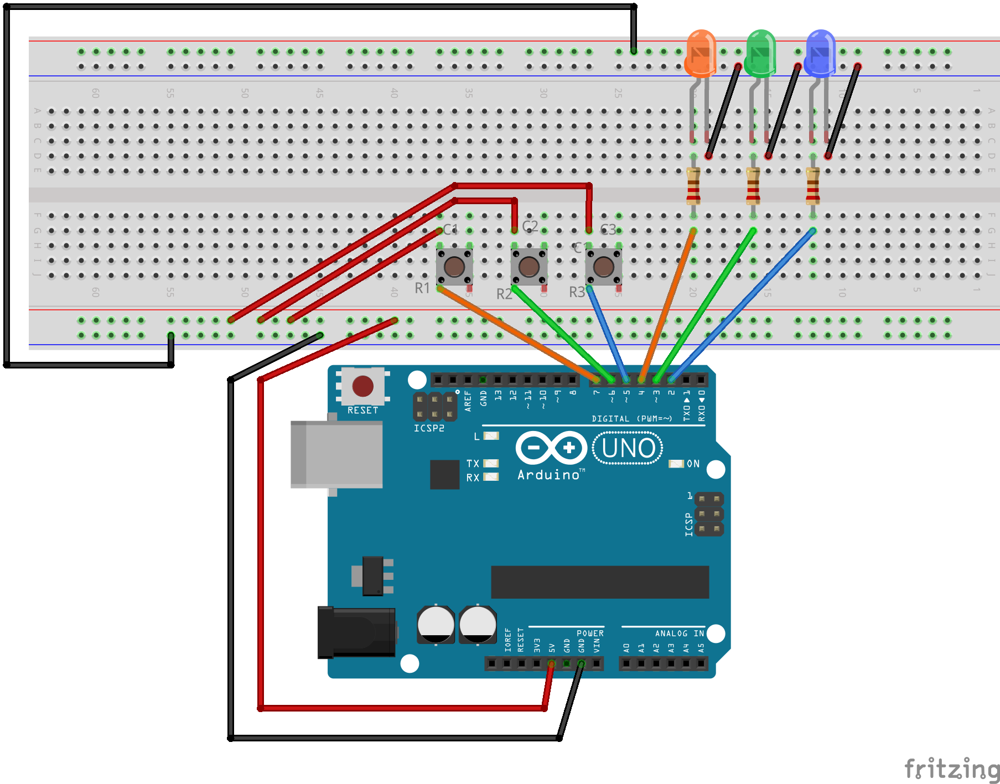

# Cilvēka reakcijas ātruma mērītājs

Ar podziņām un dažādu krāsu diodēm kā slēdžiem var izveidot ķēdi, kura 
nosaka cilvēka reakcijas ātrumu milisekundēs. Eksperimenta gaita ir šāda: 

Vienu un to pašu mērījumu atkārto 10 reizes: 

* Ik pēc 5 sekundēm (ar +/- 1 sekunžu nobīdi) iededz vienu gaismas diodi no trim. 
  Visas trīs diodes ir dažādās krāsās (piemēram, sarkana, zaļa, zila). 
* Lietotājs (cilvēks, kura reakcijas ātrumu mēra) nospiež 
  atbilstošu podziņu - eksperimenta sākumā ir paziņots, kurai 
  krāsai atbilst kura podziņa. 
* Ja nospiestā podziņa neatbilst diodes krāsai, atbilstošo
  mērījumu ignorē. Nomēra milisekundes, 
  kas pagājušas starp LED diodes iedegšanos un podziņas nospiešanu. 
* Pēc katra mērījuma  
  reakcijas ātrumu izdrukā uz seriālā porta (vajadzēs atvērt **Serial Monitor**). 
  Ik pēc 10 mērījumiem uz seriālā porta izdrukās visu šo mērījumu 
  vidējo aritmētisko. 

*Piezīme:* Podziņu nospiešanai vislabāk lietot $4 \times 4$ podziņu matricu. 
Tā kā podziņas tur novietotas ļoti tuvu viena otrai (nepietiek vietas, lai uz 
blakus podziņām turētu dažādus pirkstus), ieteicams vajadzīgās podziņas izvietot 
pa diagonāli. Maketēšanas plaknes zīmējumā parādīts, ka oranžajai LED lampiņai 
atbilst kontakti **R1**, **C1**; zaļajai LED lampiņai kontakti **R2**, **C2**; 
zilajai LED lampiņai kontakti **R3**, **C3**. 

