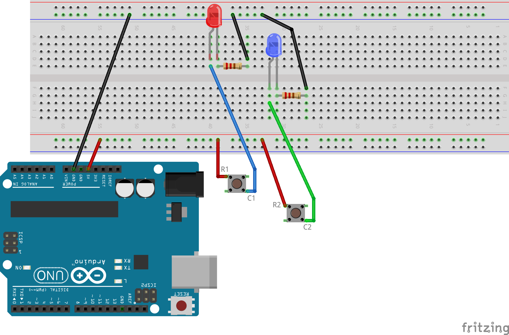

# Diožu ieslēgšana ar pogām

4x4 pogu panelī ir 16 pogas un 8 izejas (apzīmētas ar R1..R4, C1..R4). 
Ja nospiež pogu, piemēram, 1.rindiņā un 3.kolonnā, tad izveidojas 
elektrisks kontakts starp R1 un C3. 

To var izmantot, lai ar šo pogu paneli ieslēgtu vairākas LED diodes
(atsevišķi vai pat vairākas kopā). Katrā no elektriskajām ķēdēm 
vajadzīgs LED un 220 omu rezistors. 

Šajā attēlā redzams, kā saslēgt divas diodes. Tās iedegsies, 
ja lietotājs nospiedīs attiecīgi pogas **S1** un **S6**. 

**Maketēšanas shēma:**

