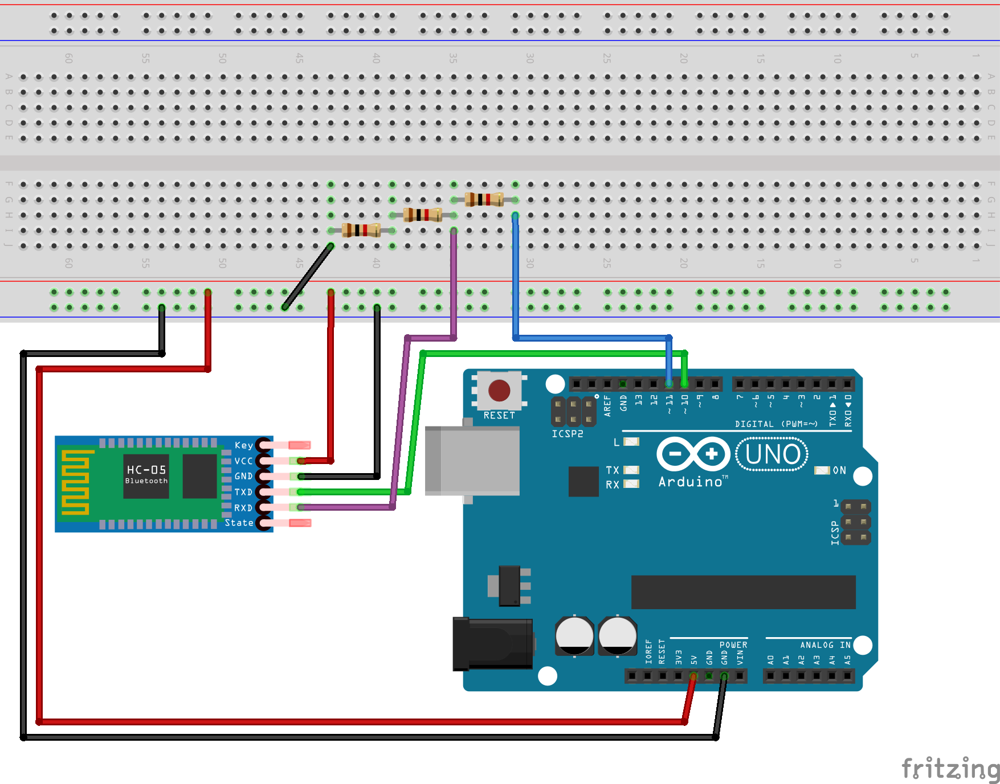

# Teksta saņemšana uz Arduino

Bluetooth savienojums izveidojams starp ierīcēm, kas atrodas dažu metru attālumā. 
Tam ir divi varianti "Bluetooth Classic" un "Bluetooth Low Energy (BLE)". 
Šajā darbā aplūkojam moduli HC-05 (vai HC-06), kas atbalsta tikai "Bluetooth Classic". 

Šim protokolam ir raksturīgi, ka viena ierīce (mūsu gadījumā Android telefons)
ir saimnieks un atklāj citas Bluetooth ierīces savā apkārtnē (piemēram, HC-05 modulīšus, 
kas pieslēgti pie Jūsu Arduino mikrokontrolieriem) un izvēlas, ar kuru 
izveidot savienojumu. Kad savienojums izveidots, abas ierīces (Android un Arduino)
var apmainīties ar ziņojumiem. 

Šajā praktiskajā darbā Android telefons sūtīs Arduino ierīcei teksta ziņojumus, 
kurus Arduino ierīce izdrukā uz seriālā porta. Tas ir pats vienkāršākais lietojums, 
kas parāda, ka HC-05 modulis darbojas normāli. 
(HC-06 spēj izdarīt tieši to pašu, bet HC-06 ir nedaudz ierobežotāks - jo tikai 
HC-05 pats spēj būt Bluetooth "saimnieks" jeb *master node* un atklāt citus. 
Savukārt HC-06 spēj tikai būt tā ierīce, kuru atklāj kāds cits jeb *slave node*.)
Mūsu praktiskajam darbam nav nekādas atšķirības, kuru no ierīcēm (HC-05 vai HC-06)
jūs izmantojat. 

**Svarīgi:** HC-05 datu saņemšanas kontaktam **RXD** ir jāsaņem dati ar
3.3 voltu spriegumu (bet Arduino ģenerē 5 voltu spriegumu - jeb, precīzāk, 
Arduino digitālie kontakti māk lēkāt starp 0V un 5V spriegumu). 
Lai nenodedzinātu HC-05, to vajag pieslēgt ar pretestībām kā attēlots zīmējumā. 
Jāieslēdz ķēdē trīs $1~\text{k}\Omega$ pretestības (nokrāsotas sarkanas). 
Uz zilā vadiņa, kas nāk no Arduino 11.kontakta reizēm parādīsies 5V spriegums
(reizēm 0V). Savukārt uz violetā vadiņa, kas dodas uz HC-05 moduļa **RXD** ieeju, 
spriegums būs reizēm 3.3V (precīzāk, divas trešdaļas no 5V), bet dažreiz 0V - tāpēc 
šis kontakts būs laimīgs, jo saņems pareizo spriegumu. 

1. Saslēgt shēmiņu un aizsūtīt programmu `ReceiveText.ino`. 
2. Atvērt uz Arduino IDE **Tools** > **Serial Monitor**. 
3. Uz kāda Android telefona uzinstalēt aplikāciju *Serial Bluetooth Terminal* 
   (Kai Morich), izmantojot **Google Play**. 
4. Atvērt *Serial Bluetooth Terminal* izvēlnē **Devices** > **Bluetooth LE**. 
   Atrast tur kādu ierīci, kuras nosaukumā ir HC-05 vai HC-06 un nospiest *Connect*. 
5. Sūtīt no Android ierīces tekstu un spiest uz bultiņas. 
6. Pārliecināties, ka Arduino IDE šo pašu tekstu izvada uz seriālā porta.

