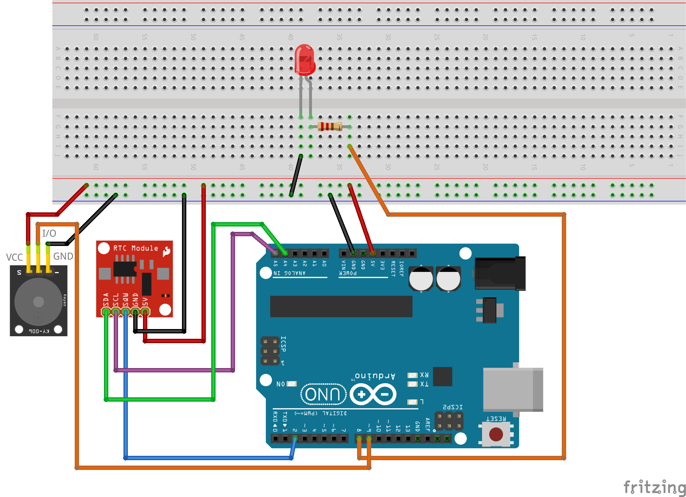

# LED ieslēgšana ar pulksteņa kvadrātvilni

Arduino platei ir spēja skaitīt laiku - piemēram "Blink" programmā 
var ielikt ``delay(ms)``, kas ietur pauzi uz noteiktu skaitu milisekunžu. 
Var arī uzzināt pašreizējās mikrosekundes un, salīdzinot ar kādu mainīgo, kas 
uzstādīts agrāk, nomērīt, 
cik laika pagājis līdz kādam notikumam (piemēram, nospiestai pogai). 
Tomēr Arduino laika mērīšanai ir vairāki ierobežojumi: 

* Arduino plate neuztur absolūto laiku (Real Time); nav iespējams 
  pajautāt šai platei, kurš gads, mēnesis, datums, stunda, minūte vai sekunde šobrīd ir. 
* Arduino plate nemēra laiku īpaši precīzi - ja procesors ir noslogots, 
  milisekundes var nedaudz "pastiepties" un ar Arduino plati izveidots 
  pulkstenis visu laiku steigtos vai atpaliktu. 
* Pat ja Arduino programmiņas darbības sākumā iestatītu laiku (un turpmāk to lietotu 
  laika skaitīšanai), visi iestatījumi pazūd tiklīdz kā plati atslēdz no strāvas 
  kaut vai uz ļoti īsu brīdi. 

Visu šo iemeslu dēļ, ir vajadzīgi pulksteņa moduļi (Real Time Clock module) kā 
piemēram DS-1307 mūsu komplektā. Lai tas atcerētos laiku arī izslēgtā stāvoklī, 
tajā ievietota neliela apaļa 3V baterija. 
Tipiski lietojumi: 

* Regulāri aplaistīt augus; 
* Ieslēgt kādu mehānismu (modinātāju, kaut kādu saziņas protokolu) noteiktā 
  laika momentā. 
* Taisīt modinātājpulksteni. 


Mūsu praktiskajā darbā programmiņa iestata reālo laiku RTC modulī (un vēlāk drukā tā 
vērtību uz Seriālā porta). Otrkārt, pulkstenis sūta Arduino platei "kvadrātvilni" - 
īpašu signālu, kas vienu sekundi ir HIGH, otru sekundi ir LOW utt. 
Šī ir daudz precīzāka laika atskaite nekā tas, ko Arduino plate var nodrošināt pati; 
Arduino modulis tagad var katras astronomiskās sekundes sākumā kaut ko darīt 
(mirkšķināt lampiņu vai pīkstēt). 



1. Saslēgt shēmiņu un aizsūtīt programmiņu `SquareWaveSwitchLED.ino`. 
2. Pārliecināties, ka reizi sekundē mirkšķinās LED un pīkst dūcējs. 
3. Atvērt uz Arduino IDE **Tools** > **Serial Monitor** un apskatīt 
   laika vērtības, ko drukā uz seriālā porta. 
4. Atslēgt Arduino ķēdi no USB vada. Pagaidīt apmēram 30 sekundes
   un pieslēgt to atkal.
5. Pārliecināties, ka pulkstenis pareizi turpina skaitīt laiku 
   arī tad, kad Arduino plate ir izslēgta.


## Pārtraukumi

Arduino programmas rindiņa:

```
attachInterrupt(digitalPinToInterrupt(SQW_PIN), sqwISR, RISING);
```

reģistrē `sqwISR` kā pulksteņa signālu *klausītāju*. Šo funkciju 
izsauc tad, kad kvadrātsignāls aiziet uz HIGH. 
Šī funkcija mūsu gadījumā tikai uzstāda vienu boolean tipa mainīgo uz "true"
(informē, plates "loop()" ciklu, ka sākusies jauna sekunde - un atkal vajag 
iedegt LED lampiņu un sākt pīkstēt). 

```
// Apstrādā SQ ievades pulsa pārtraukumu
void sqwISR() {
  toggleState = true;
}
```


