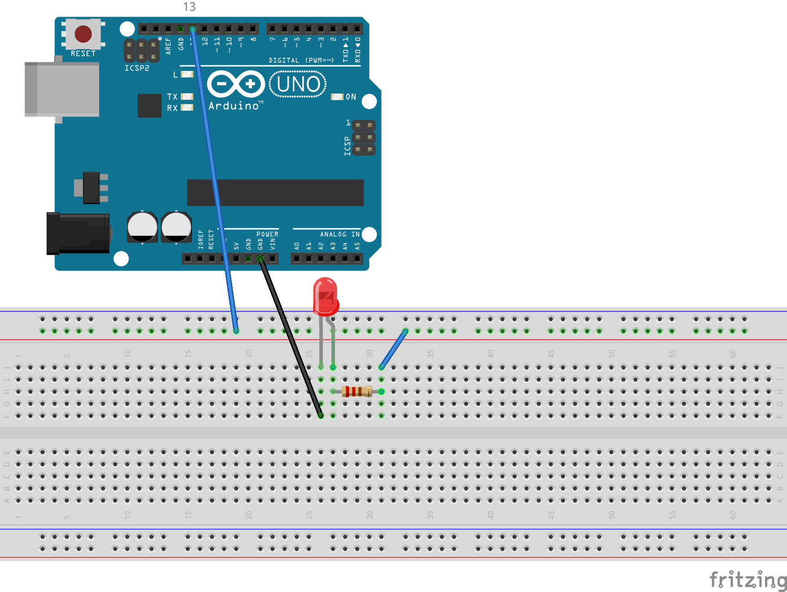
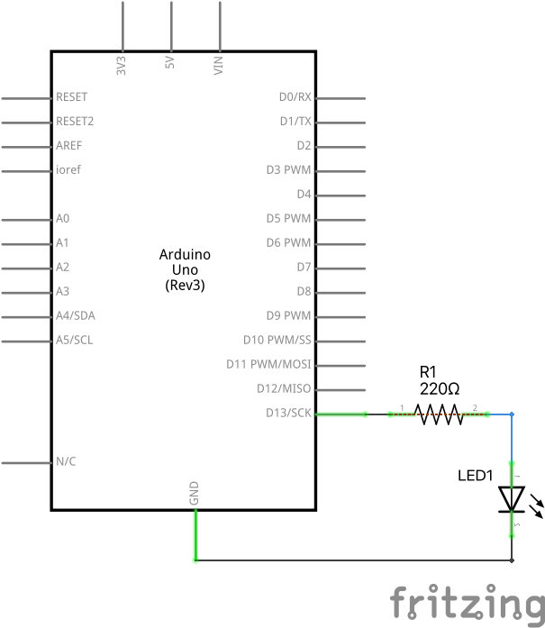

# Mirkšķināšana

Vienkārša Arduino programmiņa ieslēdz un izslēdz spriegumu uz 13.kontakta. 
Diskrētā izeja nr.13 ir pieslēgta arī LED gaismiņai uz pašas plates.
To var mirkšķināt vienu pašu bez nekādām ārējām elektriskām ķēdēm.
13.kontakts mirkšķina LED diodi uz plates (kura tieši saslēgta ar 13.kontaktu), 
gan arī ārēju diodi. 

Drusku uzskatāmāku šo pašu eksperimentu var padarīt, pievienojot 
ārēju LED diodi (tāpat kā iepriekš - kopā ar rezistoru saslēgtu virknē). 
Ievērosim, ka **HIGH** mūsu programmiņās ir 5 voltu spriegums. 

Šeit tā pati ķēde kā shēma: 

