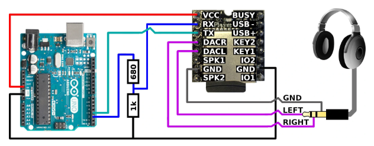
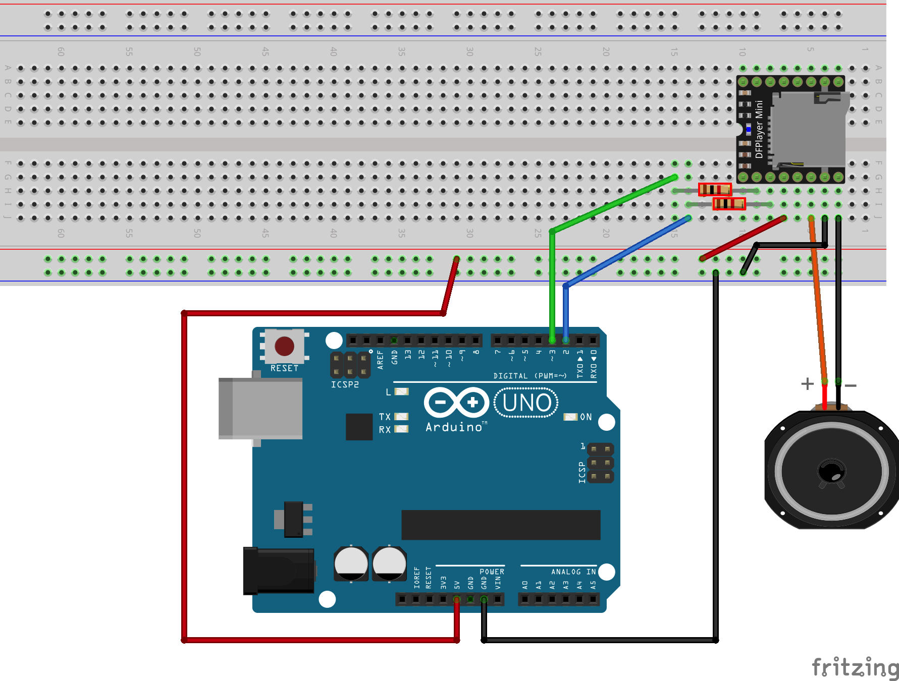

# MP3 atskaņotājs DFPlayer Mini



Atskaņotājs skatās uz mini SD karti un ļauj izvēlēties MP3 trekus, 
ko atskaņot. Tas var noderēt, piemēram, Arduino projektiem, kuriem ir jāatskaņo 
informācija cilvēka balsī. Tā kā neizmantojam austiņas, DACR, DACL kontakti 
netiek lietoti; tai vietā pie **SPK1** un **SPK2** ir pieslēgts ārējs
skaļrunītis. Tam atšķiras "+" un "-" kontakti ("-" kontakts ir 
pieslēgts pie **SPK2**). 


Arduino kontrolē atskaņotāju izmantojot kontaktus **RX** (receiver - saņēmējs)
un **TX** (transmitter - raidītājs). 
Tā kā MP3 atskaņotājs saņem visu, ko raida Arduino (un arī otrādi - raida 
visu to, ko saņem Arduino), tad uz MP3 atskaņotāja šos portus apzīmē tieši 
otrādi.

```
const uint8_t PIN_MP3_RX = 2; // Savienots ar MP3 atskaņotāja TX
const uint8_t PIN_MP3_TX = 3; // Savienots ar MP3 atskaņotāja RX
SoftwareSerial mySoftwareSerial(PIN_MP3_RX, PIN_MP3_TX); 
```



Lai varētu atskaņot kaut ko, vajag ievietot atskaņotājā mikro SD karti. 
Tajā ir MP3 faili - tie izvietoti direktorijās `01`, `02`, `03` utt. 
(Pavisam iespējamas līdz 100 direktorijas līdz `99`).
Katrā direktorijā ir atļauti līdz 255 treki, kas sanumurēti no "0001.mp3"
ar četrciparu numuriem. Šādā situācijā direktorijas un treka numuru 
nosaka divi nelieli skaitlīši. 

Lai varētu kontrolēt MP3 atskaņotāju, veiciet sekojošas darbības: 

1. Saslēdziet shēmu un pārliecinieties, ka MP3 atskaņotājā ievietota mikro SD karte.
   Izmantojiet $1~k\Omega$ rezistorus (nokrāsoti sarkani).
2. Aizsūtiet uz Arduino kontrolieri skriptu "PlayingMP3.ino". 
3. Ieslēdziet Arduino IDE seriālo monitoru (**Tools** > **Serial Monitor**).
4. Izvēlieties kādu disku un treku (sk. sarakstu [songs.md](songs.md)).
5. Varat mikro SD kartei pievienot arī jaunus MP3 failus (tos var ierakstīt
   ar [Voice Recorder](https://play.google.com/store/apps/details?id=com.media.bestrecorder.audiorecorder) vai līdzīgu Android aplikāciju. Tiem var izveidot 
   atsevišķu direktoriju, piemēram "05" vai "06" (jo 01...04 ir aizņemtas).

Uz mikro SD kartes nevajag atstāt citus failus (kuri nav sanumurēti 
vai kuri nav MP3 faili), lai neapmulsinātu MP3 atskaņotāju.

