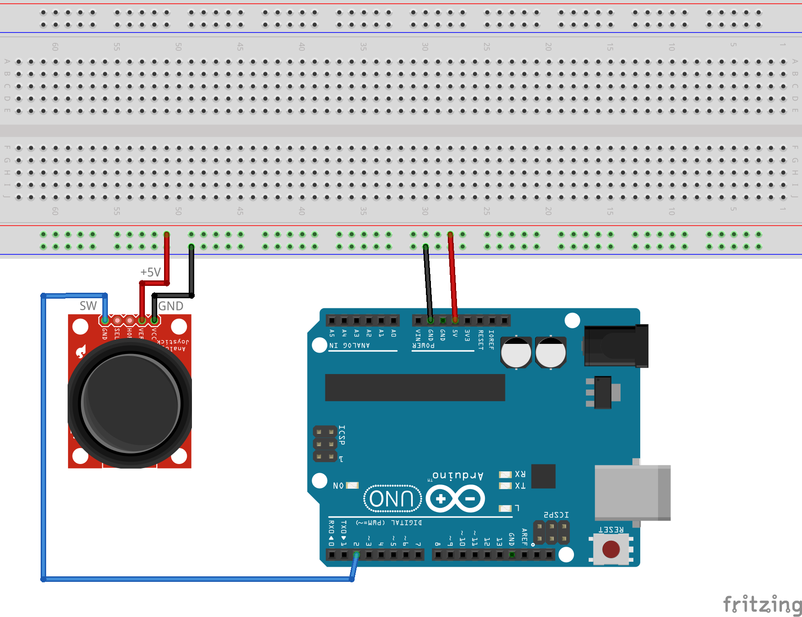

# Kursorsviras klikšķu skaitīšana

Vingrinājuma mērķis ir skaitīt, cik reizes nospiesta kursorsviras (joystick'a)
poga un attēlot rezultātu uz Seriālā monitora.
Šajā vingrinājumā kontaktus **VRX** un **VRY** pie Arduino nepievieno, 
jo kursorsviras novietojums XY plaknē mūs neinteresē; ir svarīgi 
tikai pogas klikšķi, ko **SW** kontakts sūta Arduino 2.kontaktam. 

1. Saslēgt shēmu un nosūtīt uz to ``CountingClicks.ino`` programmu. 
2. Uz Arduino IDE atvērt **Tools > Serial Monitor**
3. Uz kursorsviras (*joystick*) klikšķināt pogu 10 vai 20 reizes un 
   apskatīt skaitļus, kurus drukā uz seriālā porta. 
   (Kursorsviras locīšanai X vai Y virzienā nevajadzētu iespaidot pogas klikšķus - tikai 
   tās nospiešanai uz leju.)

## Pogu atlecināšanas (debouncing) problēma

Var viegli izrādīties tā, 
ka seriālais ports vienu pogas klikšķi ieskaita vairākas reizes
(šo uzvedību nevar vienmēr garantēt, tā atkarīga no dažādām nejaušībām).

Nākamajā vingrinājumā [CountingClicksDebounced](../CountingClicksDebounced) 
izmantosim šo teoriju un veidosim elektrisko shēmu un programmu tā, 
lai klikšķus vienmēr skaitītu pareizi, lai viens 
pogas nospiediens mehānisma neprecizitātes vai 
elektrisku trokšņu dēļ netiktu ieskaitīts vairākkārt.

