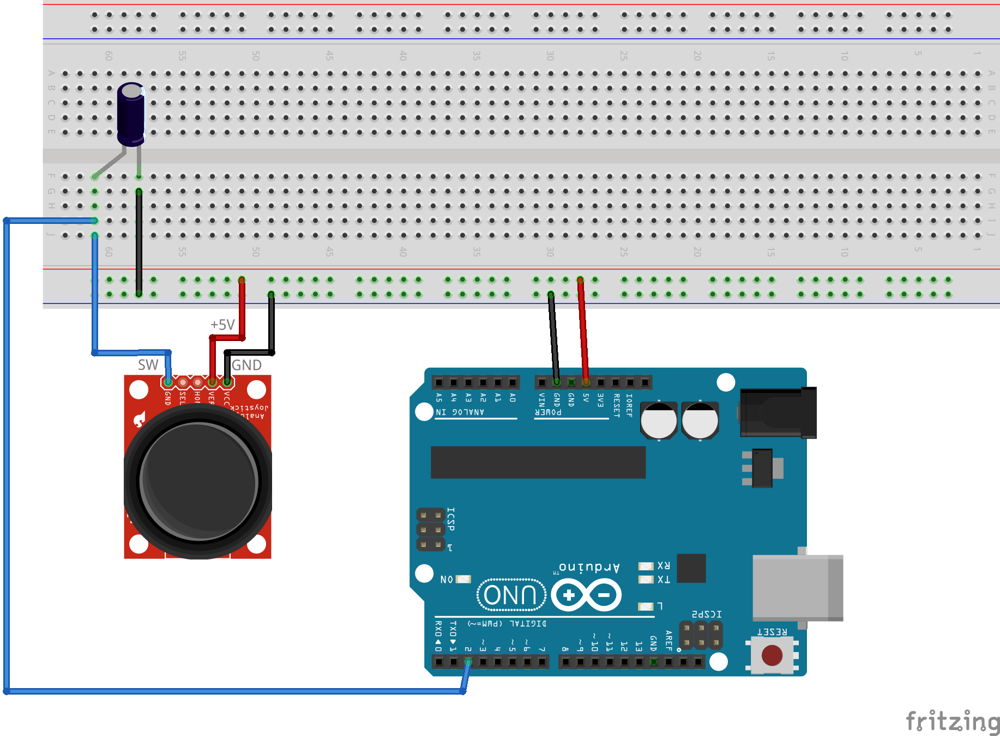
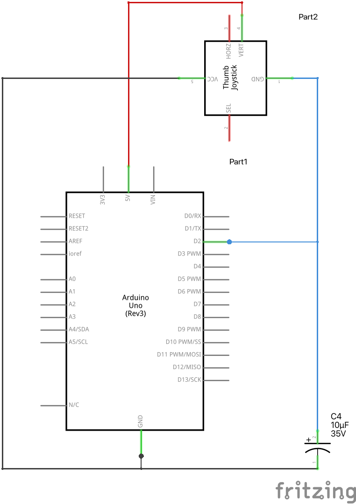

# Kursorsviras klikšķu skaitīšana ar atlecināšanu (debouncing)

Kā jau ievērojām [CountingClicks](../CountingClicks) piemērā, 
var gadīties, ka viens pogas klikšķis ieskaitās vairākkārt.
Tas pats attiecas ne tikai uz kursorsviru, bet uz jebkādām citām 
ievades pogām. Par to Arduino.CC mājaslapā ir 
teorija [Debounce](https://docs.arduino.cc/built-in-examples/digital/Debounce/)

Lai to novērstu, izmainām skriptu (atbilstoši Arduino.CC mājaslapas padomiem)
un vēl arī ieviešam elektriskajā ķēdē 
nelielu (10 mikrofaradu) kondensatoru starp **GND** un 2.kontaktu.
Darbības līdzīgas kā iepriekšējā vingrinājumā: 

1. Saslēgt shēmu un nosūtīt uz to ``CountingClicksDebounced.ino`` programmu. 
2. Uz Arduino IDE atvērt **Tools > Serial Monitor**
3. Uz kursorsviras (*joystick*) klikšķināt pogu 10 vai 20 reizes un 
   apskatīt skaitļus, kurus drukā uz seriālā porta. 
   Šoreiz skaitļiem vajadzētu pieaugt tikai par 1 uz 
   katru pogas klikšķi.

Maketēšanas shēma:

Elektriskā shēma: 

