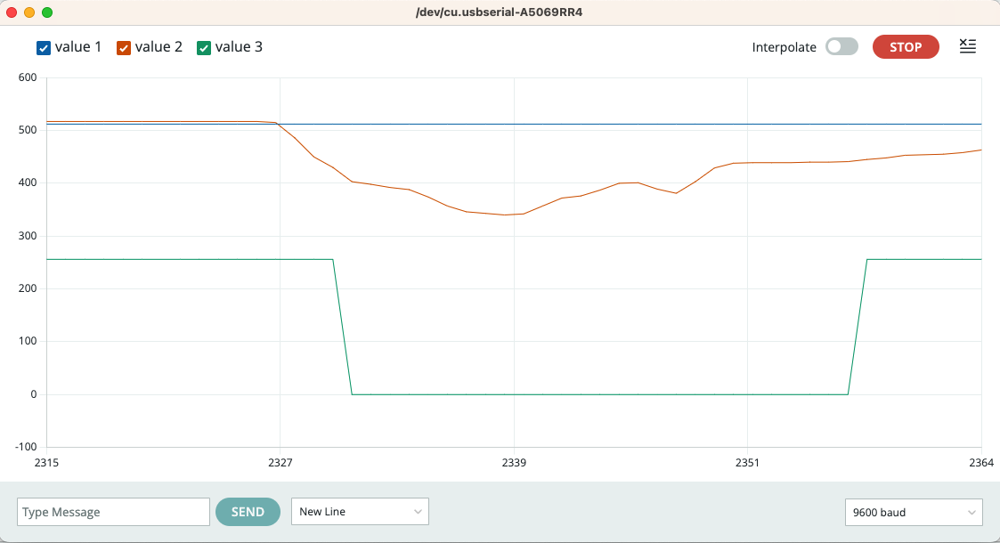

# Kursorsviras stāvokļu nolasīšana

Šoreiz kursorsvirai pieslēdzam arī XY stāvokļu nolasītājus. 
Tie uzvedas līdzīgi kā divi potenciometri - sūta skaitļus 
no intervāla $[0; 1023]$ uz Arduino analogajiem kontaktiem, 
piemēram **A0** un **A1**. 
Debouncing ķēdi ar kondensatoru var atstāt, ja ir plānots
arī skaitīt klikšķus, bet tieši šim vingrinājumam tā nebūs vajadzīga. 
Tai vietā attēlosim kursorsviras stāvokļus ar grafiku. 

1. Saslēgt shēmu un nosūtīt uz to ``ReadingState.ino`` programmu. 
2. Uz Arduino IDE atvērt **Tools > Serial Plotter**
3. Uz kursorsviras (*joystick*) klikšķināt pogu un arī kustināt 
   pašu sviru horizontāli un vertikāli. 

Attēls uz *Serial Plotter*: 

