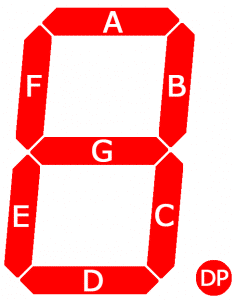
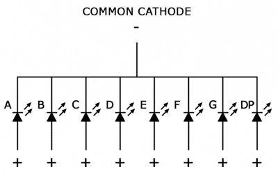
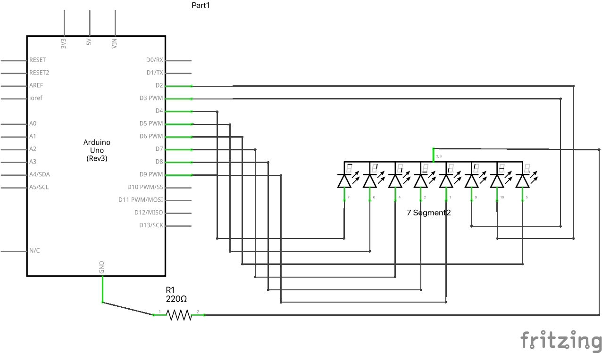
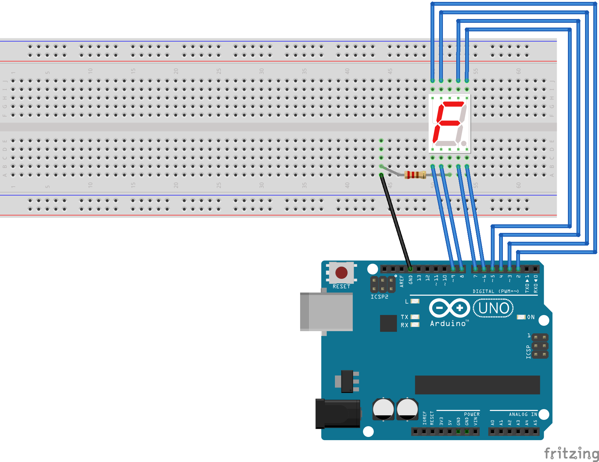

# Cipara zīmēšana uz 7 posmu LED displeja

<table>
  <tr>
    <td></td>
    <td></td>
  </tr>
</table>

Elektroniskas ierīces mēdz izvadīt ugunīgus cipariņus. Vienkāršs displejs ir 
no 7 gaismas diodēm izveidots "astoņnieks", kurā ieslēdzot 
vai izslēdzot dažus posmus var uzzīmēt visus ciparus no 0 līdz 9 apmēram kā kalkulatora 
ekrānā. 

Mūsu komplektā ir LED displeji, kuriem ir "kopīgais katods" (*common cathode*), 
t.i. vidējās kājiņas augšā un apakšā ir katods jeb **GND** kontakts. 
Attēlā to attēlo kā **GND** vai vai arī kā mīnusu.
Pārējās kājiņas pieslēdzas katram no 7 posmiņiem, kuras veido cipara 
ģeometrisko izskatu (un vēl arī viena kājiņa, kas nosaka "DP" - "decimālo punktu"). 

Visām LED diodēm displejā ir spēkā apmēram tie paši ierobežojumi 
(2 voltu sprieguma kritums un 20 miliampēru strāvas stiprums),
kas ir atsevišķajām krāsainajām LED-F5 diodēm. Tādēļ nepieciešams $220~\Omega$
vai līdzīgs rezistors. To loģiski uzlikt uz katoda, jo visa strāva plūst caur šo katodu.
(Teorētiski varētu arī pieslēgt pretestības 
arī otrā pusē - pie visām LED diožu kājiņām, bet tad vajadzētu astoņas 
$220~\Omega$ pretestības.)

Kopīgā katoda displeju attēlo šāda elektriskā shēma:

Elektriskā shēma:

Maketēšanas shēma:

