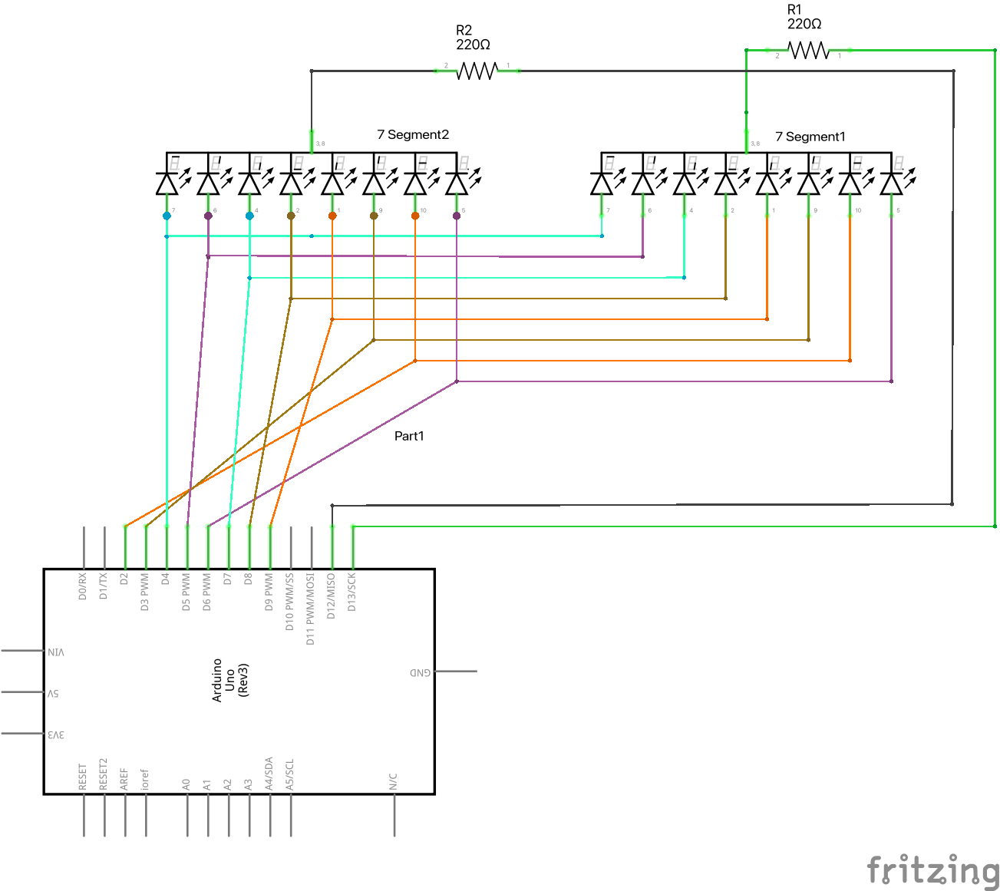
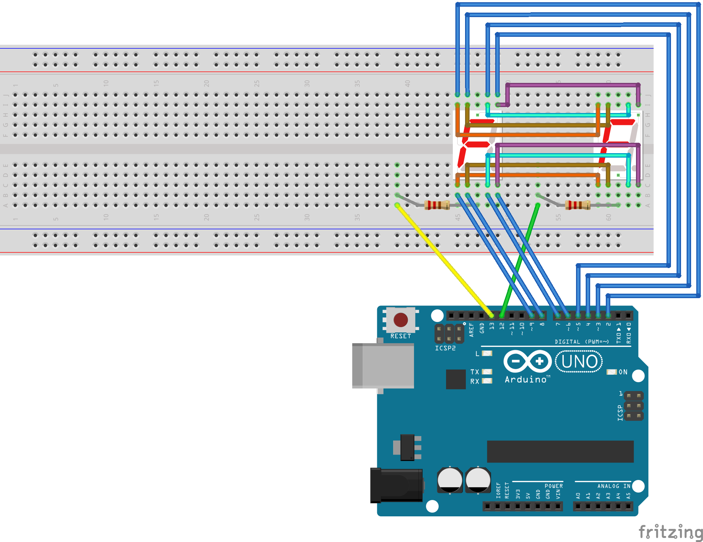

# Divi LED cipariņi ar multipleksēšanu

Piemērā [Viens LED displeja cipars](../LedDisplay5161AS/DisplayDigitPlain) 
redzējām, ka LED cipariņa kontrolei vajag 8 vai 9 kontaktus no 
Arduino plates (atkarībā no tā, vai vajag izmantot decimālo punktu). 
Divu cipariņu attēlošana prasītu jau 9+9 = 18 kontaktus, 
bet Arduino platei nemaz nav tik daudz diskrēto kontaktu
(diskrētie kontaktu ir pavisam 14, tie sanumurēti ar skaitļiem no 
0 līdz 13).

Lai zīmētu skaitlīšus uz diviem LED cipariņiem, jāizmanto triks, ko sauc 
par "multipleksēšanu". T.i. Arduino kontrolieris ļoti ātri pārslēdzas 
starp abiem cipariņiem - reizēm viņš zīmē vienu cipariņu, reizēm - otru. 
Pārslēgšanās starplaikos cilvēks nepamana, ka attiecīgais cipariņš tiek atslēgts, 
jo katram cipariņam ļoti bieži sūta atjauninājumus.
(Multipleksēšana parādījās arī agrīnajās televīzijas tehnoloģijās - kurās viens un tas
pats kineskops ar elektronu plūsmu "zīmēja" punktus uz televizora ekrāna, ļoti 
strauji skrienot pa visām rindiņām.)

Lai panāktu multipleksēšanu, saslēgt diagrammu, kas redzama šajā elektriskajā shēmā: 



Vai maketēšanas plates zīmējumā: 



Ievērosim, ka tikai iezemējumus katram cipariņam kontrolē katram atsevišķi. 
Visas citas diodes ir saslēgtas tā, ka vienu un to pašu posmiņu kontrolē tas 
pats Arduino kontakts (bet tikai tad, ja iezemējums ir pieslēgts pie **GND**). 
Tas var šķist neparasti - lai kādu LED displeja posmu ieslēgtu, iezemējums 
ir jāpieslēdz pie **LOW** (0 voltu sprieguma). Lai visus posmus izslēgtu
(lai šajā laikā varētu zīmēt blakusesošo cipariņu)
LED displeja iezemējumu pieslēdz pie **HIGH** (5 voltu sprieguma). T.i. 5V spriegums 
visas diodes izslēgs, jo tām vai nu uz attiecīgā LED displeja diodes 
posma kājiņas arī būs 5 voltu spriegums 
(nav spriegumu starpības), vai nu arī uz šīs kājiņas būs 0 volti (bet tad diode 
arī nespīdēs, jo būs ieslēgta nepareizā virzienā). 


## Veselo skaitļu dalīšana un atlikumi

Pievērsiet uzmanību šim trikam programmiņā:

```
displayNumber(k / 10, 12);
displayNumber(k % 10, 13);
```

Ja "k" ir skaitlis robežās no 0 līdz 99, tad "k%10" (atlikums, dalot ar 10) ir 
skaitļa pēdējais cipars. Bet "k/10" (dalījums, dalot ar 10) ir 
skaitļa priekšpēdējais cipars. s 