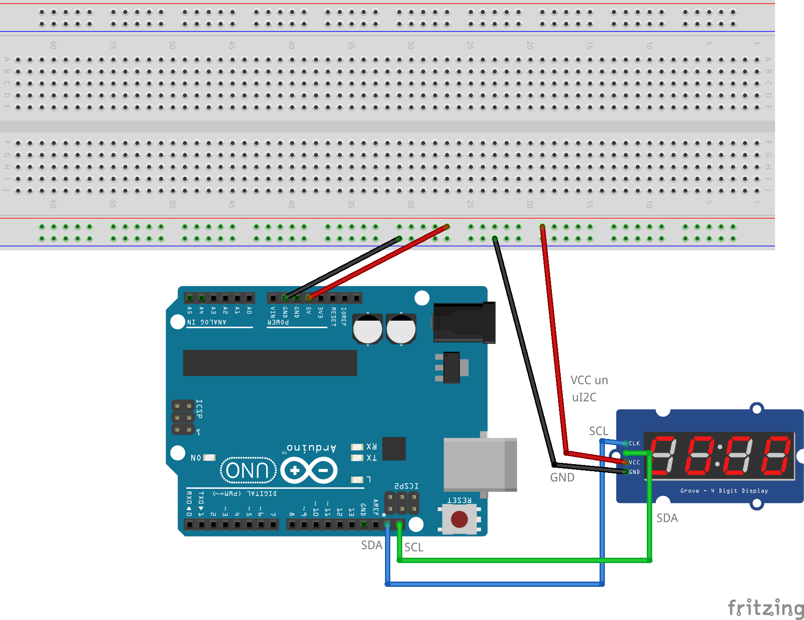

# Skaitītājs uz LED displeja

LED displejs ar četriem 14-segmentu cipariem (5141AS)
atšķiras no tiem LED displejiem, ar kuriem darbojāmies līdz šim. 
Lietotājs tam nekontrolē katra 14-segmentu cipara katru 
atsevišķo segmentu kā atsevišķu diodi; nav arī vajadzības pieslēgt 
papildu rezistorus, jo tie visi ir iebūvēti modulī. 

Modulim ir 5 kontakti; Arduino ar šo ierīci sazinās ar I2C protokolu
un pats modulis izdomā, kurus segmentus iezīmēt. 
Vienlaikus lietotājam ir pilna kontrole pār jebkuru no 4*14 = 56 segmentiem, 
uz tiem var attēlot jebkuru bildi - nav obligāti jāzīmē cipariņi. 

1. Vispirms vajag saslēgt elektrisko shēmu. Ņemiet vērā, ka 
   displejam ir 5 kontakti. ABUS kontaktus (**VCC** un **Ui2C**)
   vajag pieslēgt pie Arduino **5V** ar diviem atsevišķiem vadiņiem 
   (Mūsu attēlā attēlots tikai viens vadiņš - rīka iespēju ierobežotības dēļ.)
2. Nosūtīt C++ programmu ``CounterWithAdafruit.ino`` uz Arduino kontrolieri. 
3. Ja programma nekompilējas, atvērt **Tools > Manage Libraries**. 
   Ierakstīt meklēšanas lodziņā "Adafruit LED Backpack" un instalēt papildu bibliotēku. 
4. Aizsūtīt programmu uz kontrolieri ar "Upload", un novērot, kā palielinās skaitītājs. 
   (Skaitītājs dažus ciparus attēlo nedaudz nepareizi - bet tā nav dzelžu problēma; 
   bibliotēkas veidotājiem šķita, ka tā ir skaistāk.)

