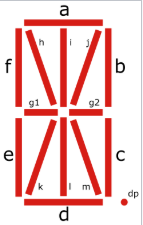
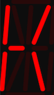

# Slīdošs teksts



Katru no segmentiem var iekrāsot ar vienu bitu 
("1", ja segmentam jādeg; "0", ja jānodziest).
14-segmentu displejs var attēlot burtus (dažreiz pat 
mazos latīņu burtus, bet parasti raksta tikai ar lielajiem). 

Sk. [14-segment display](https://en.wikipedia.org/wiki/Fourteen-segment_display)
Vikipēdijas rakstu, kurā pateikts, kā šos burtus pararsti attēlo. 
Protams, var zīmēt arī ciparus un dažus citus simbolus. 

Viens no lietojumiem ir slīdošs teksts, ko pabīda vienu pozīciju 
pa kreisi ik pēc 400 milisekundēm (parasti bīda vēl nedaudz ātrāk).


## Kā izlabot nepareizi iekodētos burtus (K, N utml.)

Programmiņu izstrādāja GPT-4.1. Tāpēc tajā ir iespējamas kļūdas.
Mēs kļūdas labojam, ņemot vērā to, ka ikviens teksta burts ir 
iekodēts ar segmentiem (apgrieztā alfabētiskā secībā). 

```
// Segmenti pierakstīti šādā secībā 
// (nav),dp,m,l,k,j,i,h, g2,g1,f,e,d,c,b,a

const uint16_t font14seg[] = {
  0b0000000000000000, // [0] space
  0b0000000000000000, // [1] placehold for !
  // ASCII 'A' to 'Z': index = letter-'A'+2
  0b0000000011110111, // [2] 'A'
  0b0000111111001001, // [3] 'B'
  0b0000000000111001, // [4] 'C'
  // ... 
};
```

Piemēram, burts "K" parasti izskatās šādi: 


