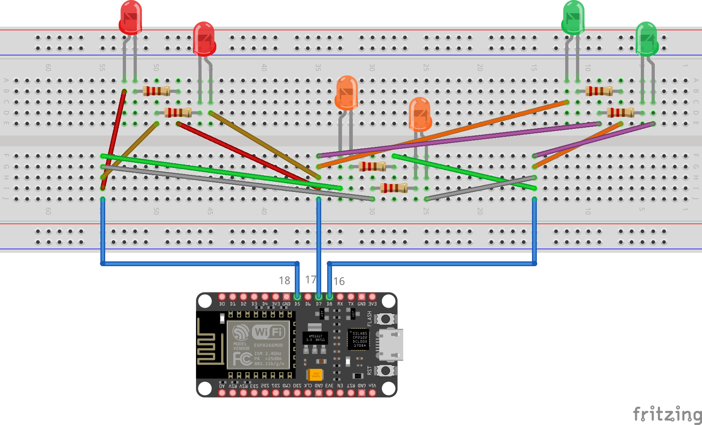

# Čārlija multipleksēšana

Nereti vajag maksimāli daudzas LED lampiņas kontrolēt ar nelielu 
daudzumu pievienoto vadu. Viens no šādiem trikiem ir
parasta multipleksēšana, kas izmanto cilvēka acij neuztveramu 
mirgošanu un rada vienlaicīguma 
iespaidu ātri pārslēdzoties starp dažādiem LED lampiņu blokiem.
Bet šāda multipleksēšana ir piemērota tad, ja vajag 
neatkarīgi vienu no otra darbināt vairākus lampiņu blokus. 

Cita situācija rodas tad, ja vajag LED ieslēgt/izslēgt 
stingri pa vienai. Šādā situācijā teorētiskais 
maksimums ar lampiņām, ko var kontrolēt ar $n$ vadiem 
ir $n(n-1)$ (cik dažādos veidos var izvēlēties vienu 
no $n$ vadiem, ko pieslēgt dotās LED katodam, un otru 
no atlikušajiem $n-1$ vadiem, ko pieslēgt dotās 
LED anodam). 

Ja $n=3$, tad var vienlaikus kontrolēt $n(n-1) = 3 \cdot 2 = 6$ 
LED lampiņas. Sal. shēmu. 
Ievērojiet, ka shēma nav pieslēgta **GND** vai **5V** kontaktiem. 

**ESP32 shēmas piemērs:** 



**Svarīgi:** Lūdzu izmantot ESP32 piemērotu kodu 
[CharlieplexingLEDs_ESP32.ino](CharlieplexingLEDs_ESP32/CharlieplexingLEDs_ESP32.ino). 
Shēma jāpievieno ESP32 plates kontaktiem **16**, **17**, **18**. 
Ievērojiet, ka kontakti **17** un **18** neatrodas blakus (starp tiem ir vēl
viens kontakts, kurš nav jāpieslēdz).

ESP32 nevarēs izmantot Arduino scenāriju ``CharlieplexingLEDs_ESP32.ino`` 
(tas ir ļoti līdzīgs, bet kontaktu numuri ir citi). 


## ESP32 instrukcijas

Uz Arduino IDE atvērt **File** > **Preferences** (uz Mac OS X: **Settings** > **Preferences**). 
Sadaļā ``Additional boards manager URLs``, ierakstīt šo vērtību:
```
https://raw.githubusercontent.com/espressif/arduino-esp32/gh-pages/package_esp32_index.json
```

Tad atvērt **Tools** > **Board** > **Boards Manager**, ierakstīt meklēšanas lodziņā 
"ESP32", un instalēt "ESP32 by Espressif Systems" (nevajag izvēlēties
otru -- "Arduino ESP32 Boards by Arduino"). 
Pagaidīt, kamēr viss ieinstalējas.

* Pievienot ESP32 plati ar USB (parasti datoram piespraužams 
  kabeļa gals, kas ir USB-A, bet ESP32 moduļa pusē tas 
  ir USB-Micro). 
* No **Tools** > **Board**, izvēlēties "ESP32 Dev Module".
* No **Tools** > **Port** izvēlēties COM seriālo portu 
  (tas var būt COM3, COM4, COM5 - atkarībā no Jūsu datora). 
* Nospiest **Upload** pogu vai no izvēlnes **Sketch** > **Upload**.


## Uzdevumi

1. Palaist CharlieplexingLEDs.ino uz Arduino Uno R3. 
   Pārliecināties, ka kontaktu uzliekot uz ``INPUT``, tas netiek
   atslēgts no elektrības (tam ir zema "impedance") -- tāpēc 
   Charlieplexing slēgums labi nedarbojas un LED lampiņas iedegas nevis pa 
   vienai, bet pa trim.