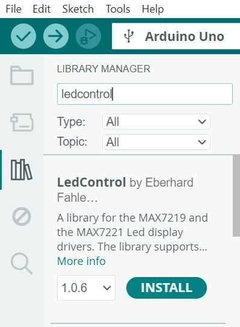
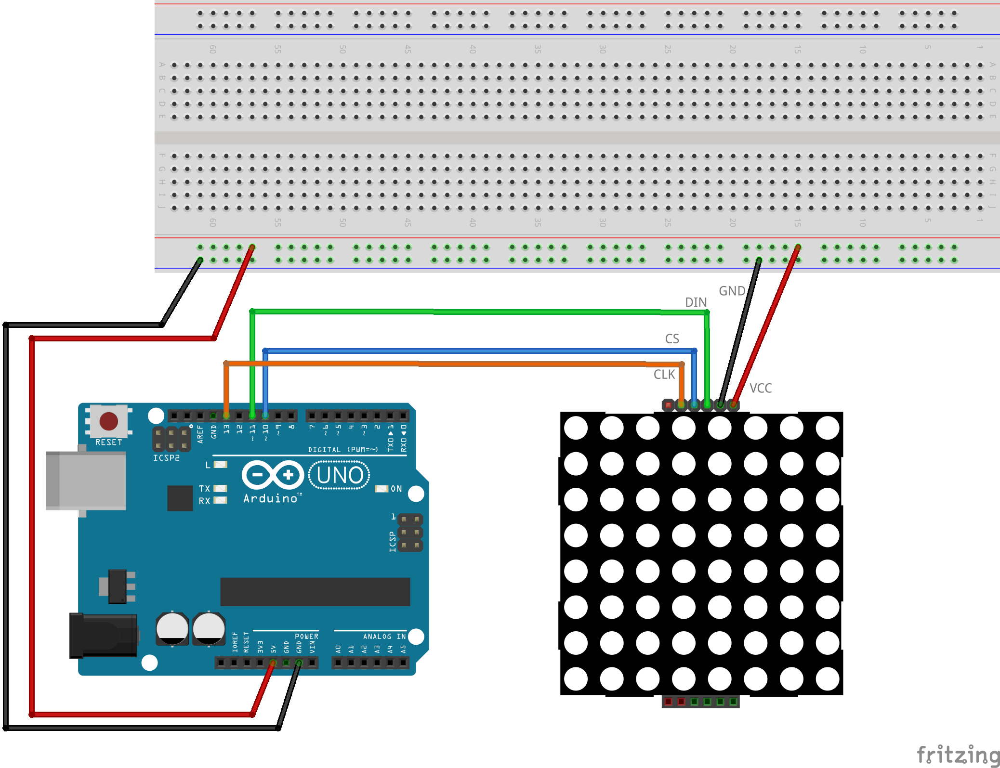

# Šaha galdiņa krāsojums

Šis attēls izmantots, lai testētu 8x8 LED matricas.
Pirms darbināt programmiņu, vajag Arduino IDE 
atvērt **Tools > Manage Libraries** un ierakstīt 
meklētājā "LedControl" un instalēt bibliotēku: 

Maketēšanas shēma:

