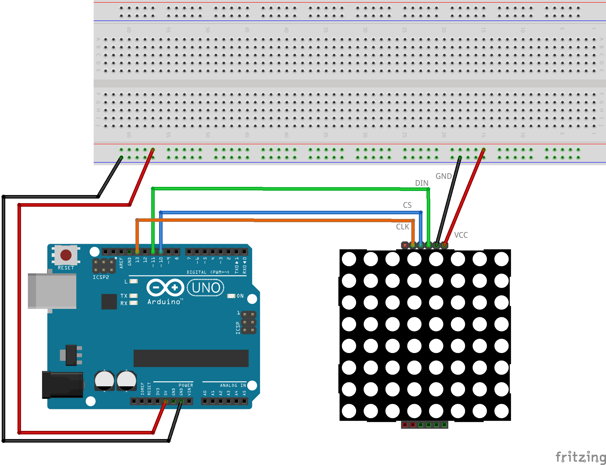

# Mēģinājums zīmēt kustīgu čūsku

LED matricu pieslēdz pie Arduino kā parasti (sk. maketēšanas shēmu). 
Vajadzētu būt tā, ka ik pēc dažām sekundēm uzzīmējas čūska, kura sastāv no 5 iedegtām 
LED spuldzītēm. Pēc tam tā palien uz priekšu par vienu vienību un zīmējas atkal. 

