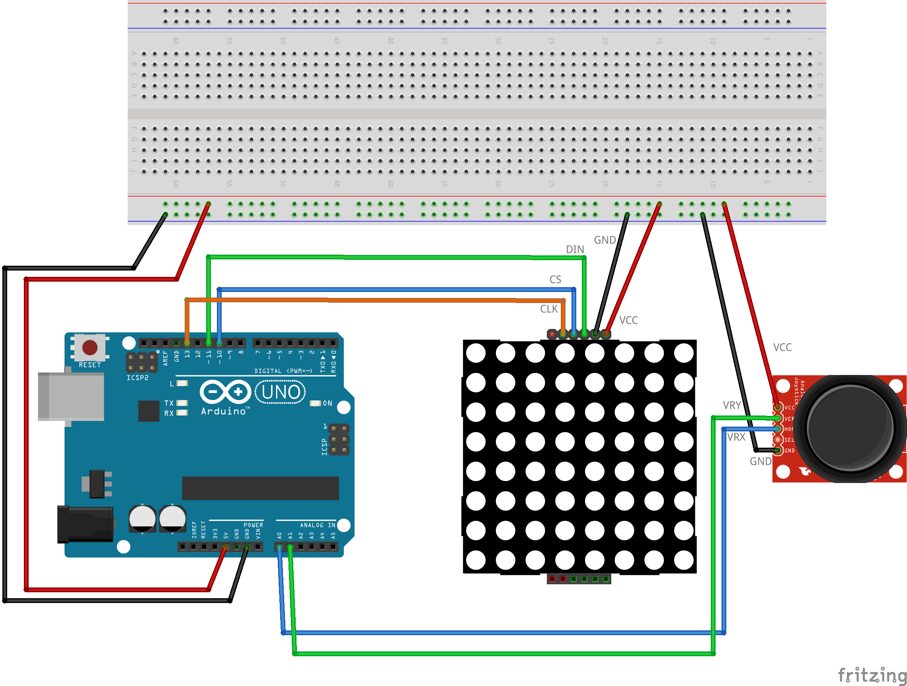

# Čūskas kontrolēšana ar kursorsviru (joystick)

Šis ir (nenotestēts) vingrinājums, kas mēģina pa ekrānu kustināt čūsku, 
izmantojot kursorsviru (joystick). Joystick pogu nevajag pieslēgt, 
tikai horizontālo un vertikālo kontaktu **VRX**, **VRY** (attiecīgi pie **A0** un **A1** - 
analogajiem kontaktiem). 

Ja kursorsvira ir neitrālajā stāvoklī (ne pārāk tālu no vērtības 512 - miera stāvokļa), 
tad čūska nekustas. Pretējā gadījumā noskaidrojam, kura novirze (pa X vai pa Y asi 
ir lielāka) un čūsku kustinām. Bet čūska nevar mainīt virzienu tieši uz pretējo -- 
sākt rāpties atmuguriski. Viņai ir jāpagriežas par 90 grādiem.