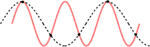

# Frekvences atrašana ar MAX 7219 sensoru

## Skaņas/spiediena pārveidošana spriegumā

Pilnīgs klusums mikrofona sensorā atbilst $1.25$ voltu 
spriegumam. 
Tā kā šis kontakts pieslēgts pie Arduino analogā kontakta **A0**, 
kas 5 voltu spriegumu pārveido par skaitli $1023$, tad 
klusums jeb 1.25 voltu spriegums 
pārveidojas par četrreiz mazāku skaitli 
$1.25V/5V \cdot 1023 \approx 256$.

Skaņas iesvārsta mikrofona membrānu un savukārt 
mikrofona membrānas svārstības izraisa 
sprieguma svārstības kontaktā **OUT**.
Parasti šīs svārstības ir ļoti nelielas un tāpēc tās 
ir jāpastiprina. Pastiprinošo reizinātāju sauc par **Gain**.

Mikrofons (atkarībā no tā, kā pieslēgts kontakts **Gain**)
māk pastiprināt trīs veidos -- par 40, 50 vai 60 decibeliem. 

* $40$ decibelu pastiprinājums nozīmē, ka spriegumu pareizina 
  ar $100$ (tātad enerģiju pareizina ar $100^2$ 
  jeb ar $10^4 = 10000$). 
* $50$ decibelu pastiprinājums nozīmē, ka spriegumu pareizina 
  ar $316$ (tātad enerģiju pareizina ar $316$ kvadrātu jeb 
  ar $10^5 = 100000$). 
* $60$ decibelu pastiprinājums nozīmē, ka spriegumu pareizina 
  ar $1000$ (tātad enerģiju pareizina ar $1000$ kvadrātu 
  jeb ar $10^6 = 1000000$).

| Pastiprinājums (Gain) | Pastiprinājuma piemērs       |
| --------------------- | ---------------------------- |
| $40~\text{dB}$        | $0.001V \times 100 = 0.1V$   |
| $50~\text{dB}$        | $0.001V \times 316 = 0.316V$ |
| $60~\text{dB}$        | $0.001V × 1000 = 1V$         |

Vienalga, kurš signāla pastiprinājums ir pielietots, 
spriegums vienmēr svārstīsies ap $1.25$ voltu vērtību. 

## Skaņas uztveramais skaļums

Skaņas skaļumu nosaka skaņas *spiediena līmenis* 
(*Sound Pressure Level (SPL)*). 
Pati klusākā skaņa, kuru dzird caurmēra cilvēks 
ir tā, kura ap atmosfēras spiedienu $10^5$ (100 tūkstoši 
paskālu jeb $100$ kilopaskāli) 
svārstās ar $20~\mu\text{Pa}$ (20 mikropaskālu)
vidējo kvadrātisko (*root mean square*) amplitūdu. 
(Maksimālā amplitūda ir vēl drusku lielāka: $20 \cdot \sqrt{2}$ 
mikropaskāli.)

Šo pašu klusāko dzirdamo skaņu apzīmē ar $0~\text{dB}$ 
(0 decibeli). Decibeli ir izveidoti tā, ka skaņas intensitātei 
pieaugot par $20$ decibeliem, spiediena amplitūda 
pieaug $10$ reizes, bet enerģija pieaug $100$ reizes. 

* 30 decibelu skaņa ($31.61$ reižu lielāka amplitūda jeb 
  $1000$ reižu enerģijas līmenis kā 0 decibeliem) 
  ir klusa balss. 
* 60 decibelu skaņa ir normāla skaļuma sarunas
* 90 decibelu skaņa ir skaļš troksnis vai auto taures uz ielas.
* 120 decibelu skaņa ir skaļš koncerts, reaktīvās lidmašīnas
  skaņa un drīz pēc tam arī cilvēka dzirdes sāpju slieksnis.

Pareizinot $20~\mu\text{Pa}$ (0 decibeliem raksturīgo spiediena 
amplitūdu) ar $1000^2$ iegūsim 
$20 paskālu$ vidējo kvadrātisko spiediena amplitūdu. 
Ja gaiss svārstās ar šādu amplitūdu, tas
jau kļūst cilvēkam grūti izturams.

## Diskretizācijas frekvence

Lai saprastu frekvenci, tā ir jāmēra pietiekami bieži.
Mērīšanas biežumu sauc par *diskretizācijas frekvenci* (*sampling rate*).  
Pēc Naikvista (*Nyquist*) teorēmas: Ja vēlamies konstatēt 
frekvenci, kura ir $B$ herci, signālu 
vajag mērīt ar biežumu vismaz $2B$ reizes sekundē.
Piemēram, cilvēka balsij pietiek ar frekvenci $8000$ mērījumi 
sekundē, jo cilvēku balsis nav īpaši spalgas - frekvences
nepārsniedz $4000$ hercus.

Ja signālu mēra retāk nekā to prasa Naikvista teorēma, 
tad no mērījumu rezultātiem nevar pareizi saprast svārstību biežumu. 
Zīmējumā redzami melni punkti - iedomāsimies, ka tajos 
ir nomērīts signāls (piemēram, mikrofona membrānas stāvoklis). 
Gan raustītajai, gan sārtajai līknei atbilst visi šie mērījumi, bet 
to svārstību frekvences būtiski atšķiras.

## Frekvences noteikšanas algoritmi

### Nulles šķērsošanu algoritms

Nulles šķērsošana (*Zero-Crossing Detection*) ir 
algoritms, kas saskaita, cik reizes spiediens ir pārgājis 
pāri 1.25V (vidējam) rādījumam virzienā no negatīvās 
puses uz pozitīvo. Saskaitot šīs pārejas vienas sekundes 
laika "lodziņā" var aptuveni novērtēt skaņas avota 
galveno frekvenci (cik augsta ir skaņa, kuru mikrofons 
šobrīd klausās). 
Šāds algoritms slikti strādā tad, ja skaņu pavada troksnis 
vai ir intensīvi virstoņi.

