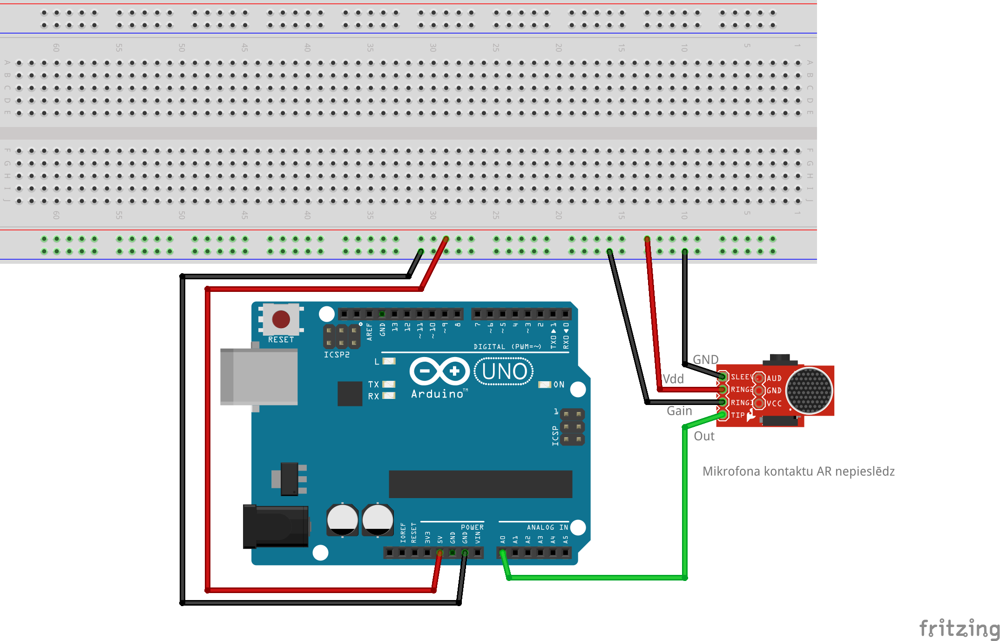

# Frekvences noteikšana ar mikrofonu

Pilnīgs klusums mikrofona sensorā atbilst $1.25$ voltu 
spriegumam. 
Tā kā šis kontakts pieslēgts pie Arduino analogā kontakta **A0**, 
kas 5 voltu spriegumu pārveido par skaitli $1023$, tad 
klusums jeb 1.25 voltu spriegums 
pārveidojas par četrreiz mazāku skaitli 
$1.25V/5V \cdot 1023 \approx 256$.

**Gain** kontakts ir pastiprinājums, jo mikrofonā tiešais skaņas 
izraisītais spriegums (novirzes no 1.25 voltiem) ir niecīgs. 

* Ja **Gain** nav pieslēgts - pastiprinājums 60 decibeli
* Ja **Gain** pieslēgts **GND** (mūsu shēmā) - pastiprinājums 50 decibeli
* Ja **Gain** pieslēgts **5V** - pastiprinājums 40 decibeli

10 decibelu pastiprinājums nozīmē to, ka enerģija (pēc pastiprināšanas) pieaugusi 10 reizes. 
60 decibeli nozīmē, ka enerģija pēc pastiprināšanas pieaugusi $10^6 = 1000000$ jeb 
miljons reižu. Tas nozīmē, ka skaņas/sprieguma amplitūda (kvadrātsakne no enerģijas)
pieaugusi $1000$ reizes. 

Ja **Gain** ir par lielu vai par mazu, kontaktu **Gain** var pārspraust.

## Gercela algoritms

TBD

## DTMF (Dual Tone Multi Frequency)

[Toņu ģenerators tiešsaistē](https://onlinetonegenerator.com/dtmf.html)

Lai telefonā ievadītu pareizo numuru, var izmantot elektronikas metodes.
Seno laiku telefonos bija rotors, kas ģenerēja elektrības pulsus vajadzīgajā 
skaitā. Bet lietotājiem bija jāgaida, kamēr rotors atgriezīsies sākumstāvoklī; 
ja numurā bija jāuzgriež cipars "0" (visgarākais - 10 pulsi), tad tas varēja 
aizņemt vairākas sekundes. Tāpēc lielu popularitāti iemantoja 
"touch tone phones" (pieskaršanās telefoni), kuri katrai telefona tastatūras 
pogai ģenerēja skaņu, kurā saliktas kopā divas frekvences. 
Frekvences bija īpaši piemeklētas tā, lai cilvēks tās varētu dzirdēt, bet tās 
nelīdzinātos dabā sastopamiem trokšņiem vai fona mūzikai, 
kas varētu izjaukt numura ievadīšanu. 

