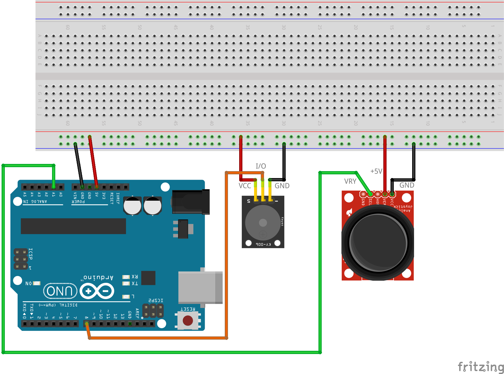

# Skaņa ar kursorsviru

**Vajadzīgās detaļas:** Arduino kontrolieris un USB vads, 
maketēšanas plate (*breadboard*), pasīvais dūcējs (*buzzer*), 
kursorsvira (*joystick*), savienotājvadi (6 M-F vadi, 2 M-M vadi). 

Šoreiz kursorsvirai pievienoti tikai 3 vadi (**VRY** vērtība nolasa 
Y koordināti kā arī **GND** un **+5V**). Horizontālā koordināte un 
kursorsviras pogu klikšķi nebūs vajadzīgi. 

Programma ciklā palielina vai samazina skaņas frekvenci - atkarībā 
no kursorsviras stāvokļa. Izteiksme `int newFreq = 2*yValue+100;`
nodrošina, ka kursorsviras vērtība (kas ir intervālā $[0; 1023]$) 
attēlojas par sadzirdamu skaņas frekvenci intervālā $[100, 2146]$). 
Tā kā frekvenču attiecība ir aptuveni $21$, tad dūcēja skaņa 
pakāpeniski mainās vairāk nekā 4 oktāvu ietvaros - no ļoti zemas līdz 
ļoti augstai. 
($2 \cdot 2 \cdot 2 \cdot 2=16$, t.i. frekvence, kas ir $16$ reizes 
lielāka, atrodas $4$ oktāvas augstāk).

