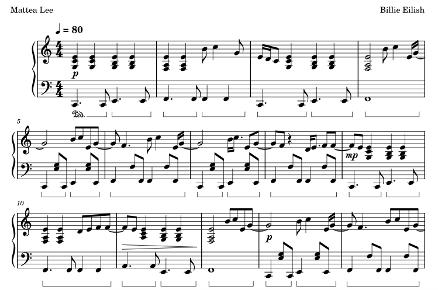

# Dažādas skaņas ar dūcēju

Dūcējam var likt atskaņot dažādas vienbalsīgas melodijas. 
Šīs ir komandas, ar kurām var atskaņot skaņas:

``` cpp
// sāk atskaņot kvadrātveida signālu ar doto frekvenci no kontakta "pin"
tone(pin, frequency); 

// tas pats (tikai uz noteiktu laiku milisekundēs)
tone(pin, frequency, duration); 

// pārstāj atskaņot signālu
noTone(pin);
```


Mūzikas fragments 
[YouTube: What was I made for (Meow)](https://youtu.be/3-y0p0GL4TI?si=0z6BQxvuVBKV_-7Z). 
Finneas O'Connell, Billie Eilish. 




## Vienādi temperēta gamma

Par hromatisko gammu uzskatām augošu skaņu virkni - parasti vienas oktāvas 
ietvaros: 

$$do,$$

Mūzikā vēsturiski izveidojušās dažādas temperācijas sistēmas 
(mūzikas instrumentu uzskaņošanas veidi).
Kopš 19.gadsimta beigām parasti cenšas visus instrumentus 
uzskaņot "vienādi temperēti" (*equal temperament*), t.i. viena oktāva (frekvenču attiecība 2:1)
satur 12 pilnīgi vienādus pustoņus: frekvence "do# pret do", "re pret do#" utt. 
"si pret augšējo do" visas ir vienādas. Ja šo attiecību vienā pustonī 
apzīmē ar $x$, iegūstam vienādojumu:

$$x^{12} = 2,\;\;\text{ jeb }\;\;x=\sqrt[12]{2} = 1.059463.$$

To, ka skaņas veido ģeometrisko progresiju, var labi redzēt uz ģitāras grifa, uz kura 
nevienādos attālumos izvietotas *ladas*. 


Kā izklausās vienādi temperētas klavieres (salīdzinot ar dažādiem vēsturiskiem temperējumiem 
jeb skaņošanas veidiem) var redzēt šajā 
[YouTube: Piano TEMPERAMENT comparison](https://youtu.be/3O5J6A4uh30?si=WbQmXgOKgec7At60). 

*Piezīme:* Tas, ko J.S.Bahs sauca par "labi temperētām klavierēm", 
visticamāk bija pāreja no kādas Baroka agrīnā posmā izplatīta temperējuma (piemēram, Meantone)
uz modernāku (piemēram, Kirnberger 2). Sal. [labais temperaments](https://en.wikipedia.org/wiki/Well_temperament). 


