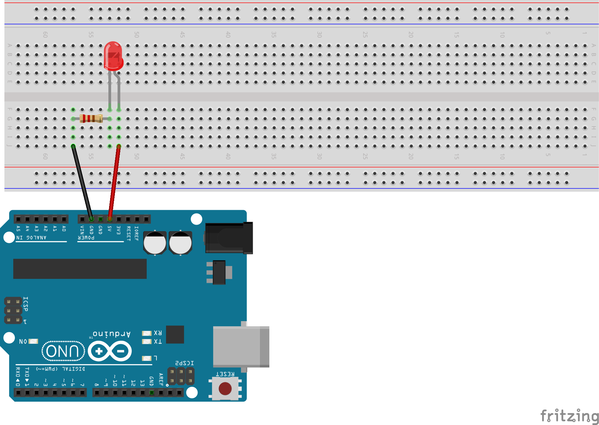
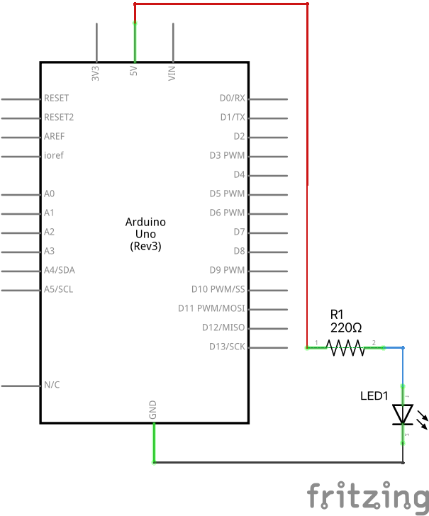

# LED un Rezistors

LED diode laiž cauri strāvu tikai vienā virzienā (no garākās kājiņas uz īsāko). 
Pašai LED lampiņai (spriegumiem, kas sasniedz 2V) ir ļoti maza pretestība, 
tāpēc tās nedrīkst pieslēgt uzreiz pie 5 voltu strāvas, ko ražo Arduino plate. 

Tāpēc LED lampiņu saslēdz virknē ar rezistoru (elektrisko pretestību). 
Nepieciešamo pretestību var izrēķināt, zinot LED diodes parametrus (2 voltu sprieguma 
kritums un 20 mA jeb 20 miliampēru strāva). 
20 miliampērus jeb 0.020 ampērus vajag iegūt situācijā, kurā 
uz pretestības esošais spriegums ir 3 volti. 
Izrēķinām pēc Oma likuma: 

$$R = \frac{U}{I} = \frac{3~\text{V}}{0.020~\text{A}} = 150~\Omega.$$

Mūsu komplektā nav 150 omu pretestības, bet ir 220 omu pretestības, kuras 
arī der. 

Šeit ir tāda pati elektriskā shēma - tikai formālākos apzīmējumos: 

