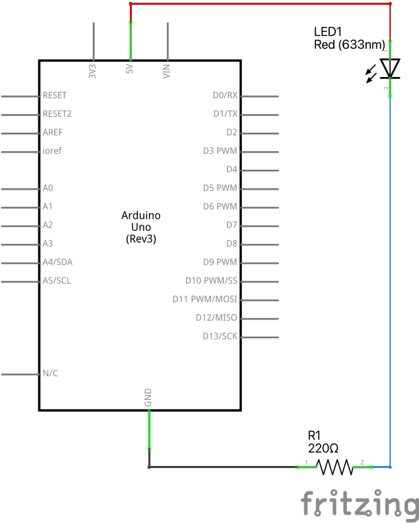

# LED lampiņas un rezistora ķēde

Elektriskā ķēde, lai varētu degt viena lampiņa:

Šeit ir tāda pati elektriskā shēma - tikai formālākos apzīmējumos: 

## Rezistori. Oma likums 

Rezistoriem (un arī daudziem citiem strāvas patērētājiem) 
strāva ir proporcionāla spriegumam - jo lielāks spriegums, jo lielāka 
strāva plūst caur ierīci.

Piemēram, attēlā redzamajam rezistoram uz katriem 5 voltiem strāvas stiprums 
pieaug par 0.002 ampēriem: $0.002~\text{A}$ jeb $2~\text{mA} (2 miliampēriem). 

Ir spēkā Oma likums: $U=IR$ (spriegums ir $I$ reiz $R$ - jeb strāva reiz pretestība). 
Attēlā redzamajam rezistoram 

$$R = \frac{U}{I} = \frac{5~\text{V}}{0.002~\text{A}} = \frac{5000}{2} = 2500.$$

Tātad šādam rezistoram pretestība ir $2500~\Omega$ (2500 omi jeb 2.5 kiloomi). 

## LED diodes

LED lampiņa jeb gaismas diode (*light-emitting diode*) laiž cauri 
strāvu tikai vienā virzienā (no garākās kājiņas uz īsāko). 
Ja to iesprauž ķēdē pretējā virzienā, tad strāva neplūst un lampiņa nedeg. 
LED lampiņai, ja tā ieslēgta pareizajā virzienā, sākot ar noteiktu spriegumu, 
ir ļoti maza pretestība - tāpēc tā var laist cauri daudz strāvas un izdegt. 
LED nedrīkst tieši pieslēgt pie 5 voltu strāvas, ko dod Arduino plate.
Sk. strauji kāpjošos grafikus dažādu krāsu diodēm. 

LED lampiņu ir pareizi ieslēgt 5 voltu ķēdē kopīgā virknē ar *rezistoru*. 
Rezistora pretestību var izrēķināt, zinot LED diodes parametrus. 
Tipiskai gaismas diodei ir $2~\text{V}$ (2 voltu) sprieguma 
kritums un tā labi deg, ja strāvas stiprums ir $20~\text{mA}$ (20 miliampēri). 
$20$ miliampērus jeb $0.020$ ampērus vajag arī otrai ķēdes daļai ar rezistoru, 
kur pārpalikušais spriegums ir $5-2=3$ volti. 

Atrodam LED diodei nepieciešamā rezistora pretestību pēc Oma likuma: 

$$R = \frac{U}{I} = \frac{3~\text{V}}{0.020~\text{A}} = 150~\Omega.$$

Mūsu komplektā nav 150 omu rezistoru, bet ir 220 omu rezistori 
(gaiši zili ar svītriņām), kuri arī der.

