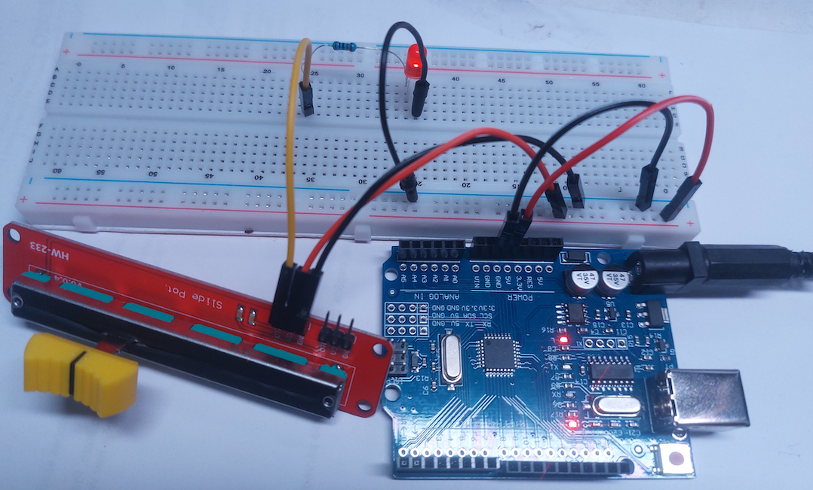

# Maiņrezistors

Maiņrezistors (arī saukts potenciometrs vai reostats) ir ierīce, kas māk 
mainīt spriegumu - tā ir iebūvēta dažādu elektronisku ierīču regulējamās pogās. 
Ir tādi maiņrezistori, kuri maina spriegumu, ja tos pagriež, bet mūsu komplektā ir 
vēl intuitīvāks maiņrezistors, kam ir slīdošs regulators. 
Ja abus rezistora galus (**GND** un **VCC**) pieslēdz attiecīgi pie 
0V un 5V, tad kontrolējamais spriegums 
uz **OTA** (sprieguma starpība starp **OTA** un **GND**) var mainīties 
intervālā $[0;5]$. 

Šajā vingrinājumā Jūs varat saslēgt LED un rezistoru virknē un 
mainīt uz tiem spriegumu. Tā kā rezistors bija aprēķināts 5V (maksimālajam spriegumam), 
tad arī jebkuru mazāku spriegumu drīkst padot. 
(Elektroniskām ierīcēm parasti ir pieļaujams dot mazāku spriegumu - ja tas būs 
par mazu, tad ķēde vienkārši nestrādās.)

