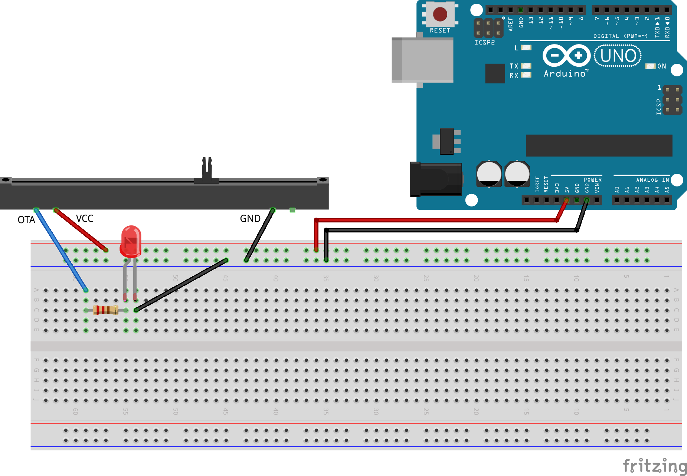
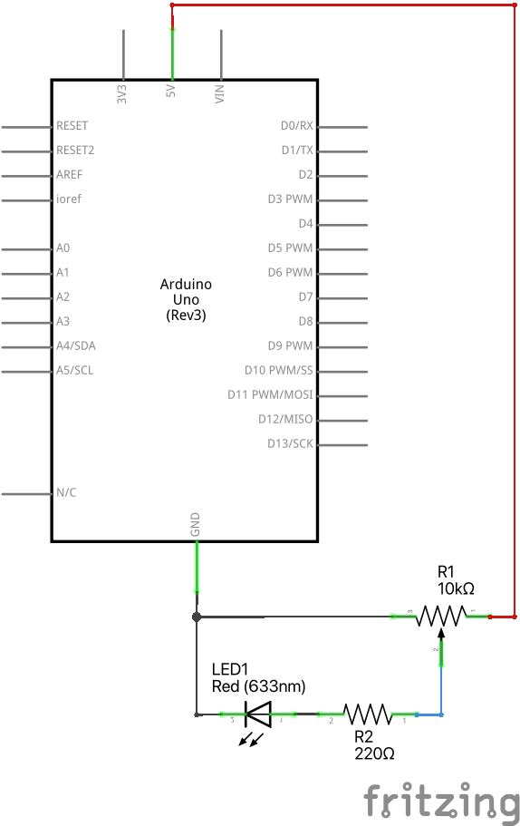
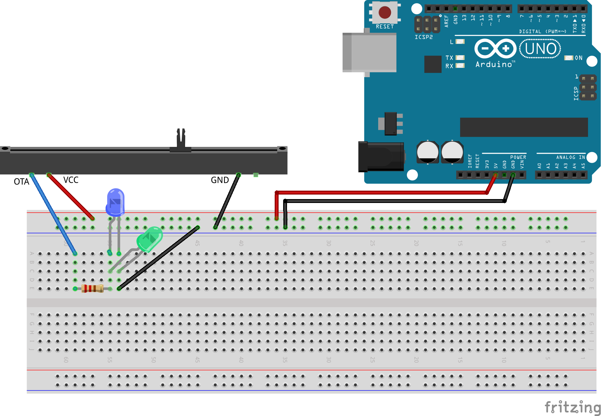
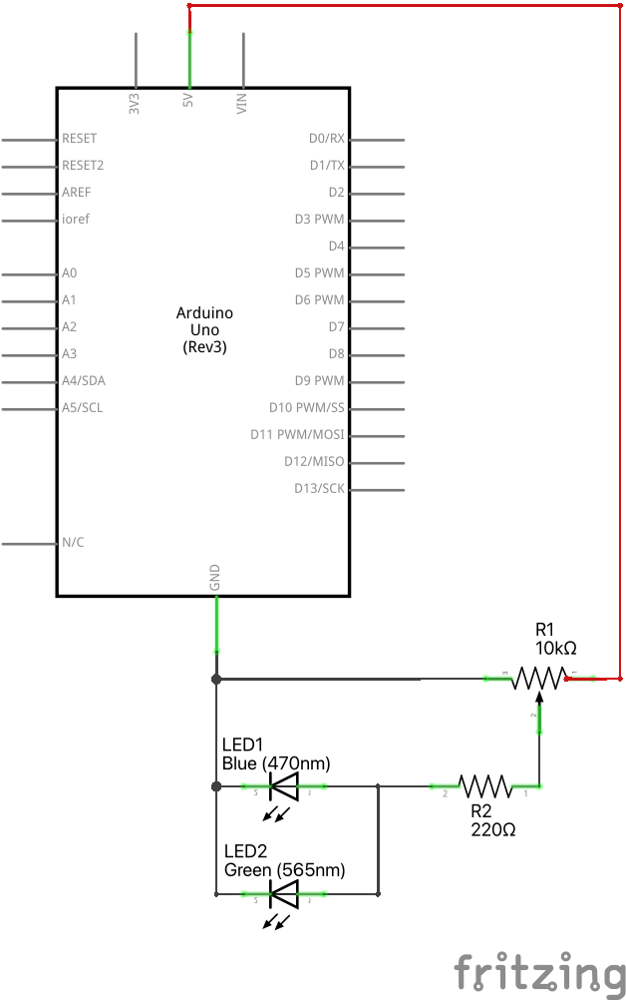

# LED ķēde ar potenciometru

Šajā vingrinājumā pieslēdzam potenciometru, lai varētu mainīt 
spriegumu, kuru saņem LED diodes un $220~\Omega$ rezistora ķēde.

**Maketēšanas shēma:**

**Elektriskā shēma:** 

## Potenciometrs

Potenciometrs ir ierīce, ko lieto diviem mērķiem:

* Kā mainīgas pretestības rezistoru (ja tam pieslēdz tikai 2 kontaktus).
  Mūsu komplektā esošais potenciometrs māk mainīt pretestību no 
  $0~\Omega$ līdz $10000~\Omega$ (10,000 omi jeb $10$ kiloomi).  
* Kā ierīci sprieguma mainīšanai (ja tam pieslēdz visus 3 kontaktus). 
  Šajā gadījumā spriegums starp **GND** un **5V** kontaktiem 
  vienmēr ir $5~\text{V}$, bet spriegums uz trešā kontakta **OTA** vai **OTB**
  (sprieguma starpība starp **OTA** un **GND**) 
  var būt jebkāda no $0~\text{V}$ līdz $5~\text{V}$ (starp 0 un 5 voltiem).

Šajā vingrinājumā var saslēgt LED un rezistoru virknē un 
mainīt uz tiem spriegumu. Tā kā ķēde bija aprēķināta 5V (maksimālajam spriegumam), 
tad drīkst padot arī mazāku spriegumu, neriskējot nodedzināt LED diodi. 

## Uzdevumi

1. Pārbaudīt sprieguma izmaiņas starp **GND** un **OTA** ar multimetru 
   (ieslēgt to 20 voltu diapazonā). 
2. Pārbaudīt, pie kāda sprieguma iedegas dažādu krāsu LED, ja tās 
   saslēgtas paralēli (kā zīmējumā). Nosakām to spriegumu, pie kura LED lampiņa 
   iedegas kaut vai ļoti blāvi.
   Pēc teorijas vajadzētu būt tā, ka pirmā (pie viszemākā sprieguma) iedegas sarkanā 
   lampiņa, tad oranžā, tad dzeltenā, tad zaļā un visbeidzot zilā. 

*Piezīme:* Tā kā lampiņas saslēgtas paralēli, tad uz tām visām ir vienāds spriegums - 
un tās var būt virknē ar vienu rezistoru, kurš tām visām ir kopīgs. 
Var, protams, izmantot arī katrai LED lampiņai atsevišķu rezistoru. 

**Maketēšanas shēma:**

**Elektriskā shēma:** 

