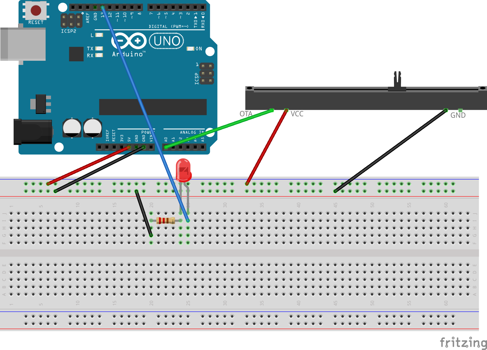

# LED ieslēgšana ar potenciometru

Šajā ķēdē pie noteikta sprieguma (aptuveni 2.5 volti jeb potenciometrs 
vidējā stāvoklī) kontakts **A0** saņems vērtību, kas ir vismaz 512
no intervāla [0; 1023]. Šajā brīdī LED lampiņu sāks mirkšķināt 
cits kontakts (kontakts **13**). 

Ja potenciometra vērtība ir zemāka, tad diodi izslēdz. 

