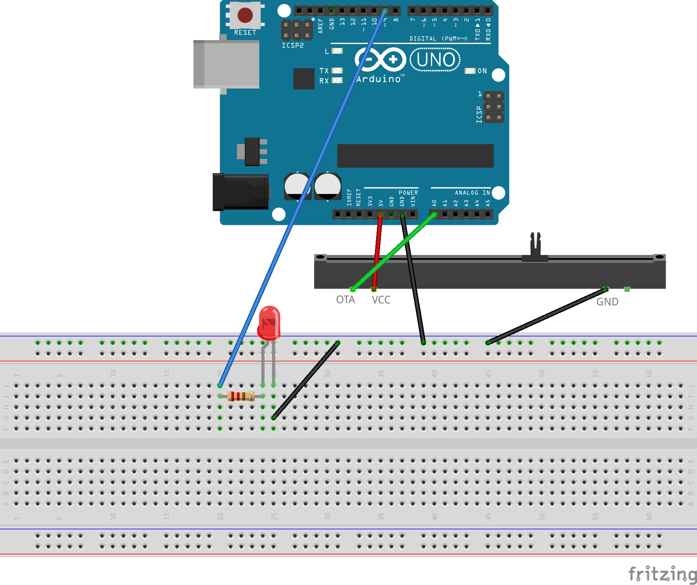

# Pulsa platuma modulācija (PWM)

LED+rezistora ķēdi var regulēt ar potenciometru - mainot spriegumu no 0V līdz 5V. 
    Ja to dara pavisam bez strāvas pārveidošanas, tad aptuveni robežās no 0V līdz 1.25V 
    sarkanā LED lampiņa nedeg vispār, jo spriegums nav pietiekams, lai radītu 
    kaut kādu pamanāmu strāvu. Lai lietotājam rastos sajūta, ka potenciometrs iespaido 
    LED lampiņas spožumu arī pie mazām potenciometra vērtībām, izmantojam PWM 
    (pulsa platuma modulāciju), lai LED gaismiņa saņemtu ievadi nevis tieši no potenciometra, 
    bet no kāda digitālā kontakta (3, 5, 6, 9, 10, 11), kurš spēj nodarboties ar PWM. 
    Tā kā šie kontakti ir digitālie, uz tiem var rakstīt jebkuru vērtību no 0 līdz 255, 
    bet tie vienkārši "lēkā" starp 0V un 5V spriegumiem. 

