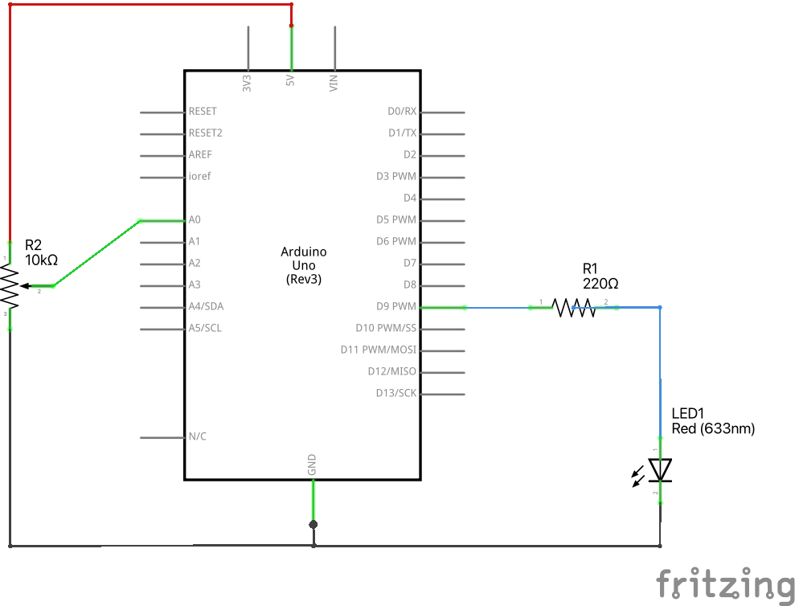
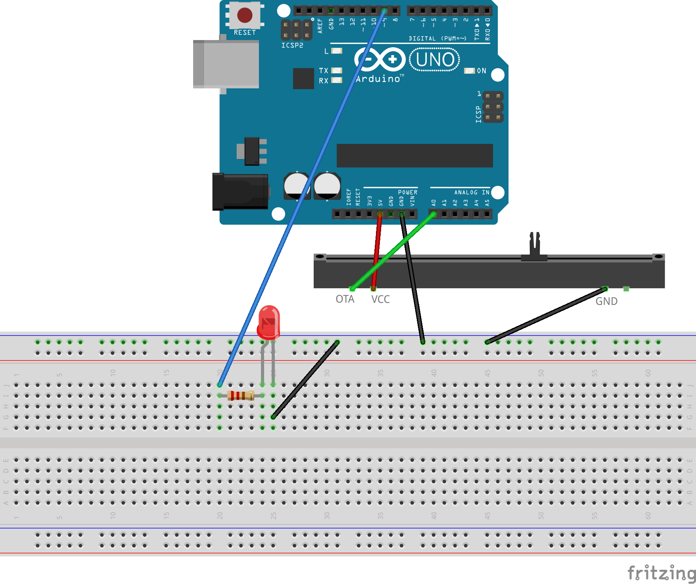

# LED diode, kas izdziest (ar Gamma korekciju)

Lietotājiem var gribēties regulēt LED gaismas spožumu.
Potenciometrs var tieši regulēt spriegumu, kas pienāk uz LED diodes. 
Šīs pieejas trūkums -- daļa no potenciometra radītā spriegumu 
intervāla (piemēram, apakšējā trešdaļa $[0V;1.67V]$) kopā ar ķēdē 
ieslēgto $220~\Omega$ rezistoru rada tik mazu spriegumu starpību uz LED 
diodes, ka tā neiedegas vispār. 

LED diodes toties labi reaģē uz pulsa platuma modulāciju -- ja diskrētās
izejas spriegums strauji lēkā starp $0~\text{V}$ un $5~\text{V}$, tad diode 
daļu laika spīd (un ja PWM frekvence ir pietiekami ātra, tad lietotājs 
nejūt diodes mirgošanu). 

Tā kā potenciometrs var radīt skaitļus intervālā $[0;1023]$, bet PWM komandas 
spēj ar pulsa platuma modulāciju izvadīt jebkuru skaitli intervālā $[0;255]$, 
tad vienkāršākais veids ir -- dalīt potenciometra rādījumu ar 4 un iegūt 
PWM vērtību, ko caur PWM kontaktu (3., 5., 6., 9., 10., 11. kontaktu)
var sūtīt uz diodi. 

Ņemot vērā to, ka cilvēka uztvere attēla gaišumam nav lineāra, parasti 
izmanto nedaudz sarežģītāku funkciju, nekā dalīšana ar 4. 
To sauc par *gamma atpakošanu* (*gamma correction*).

<table>
<tr>
<th>
Lineārs attēlojums no $x \in [0;1023]$ uz $y \in [0,255]$
</th>
<td>
$y = x/4$
</td>
</tr>
<tr>
<th>
Attēlojums ar gamma korekciju
</th>
<td>
$y = 255 \cdot \left( \frac{x}{1023} \right)^{2.2}$
</td>
</table>

Cilvēkam faktiski attēlo kvadrātiski augošu funkciju, bet viņam 
var rasties ilūzija, ka potenciometrs diodes spožumu maina
vienmērīgi. 

Elektriskā shēma: 

Maketēšanas plates attēls:

