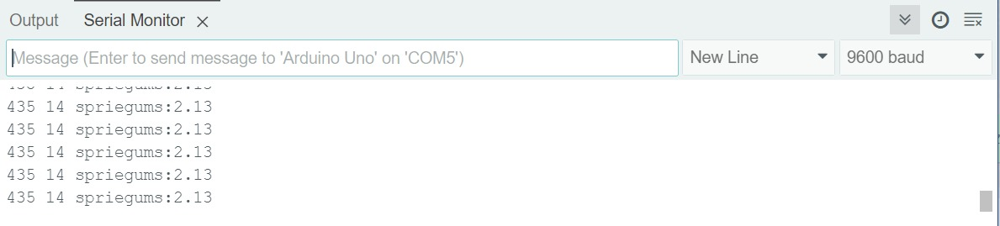
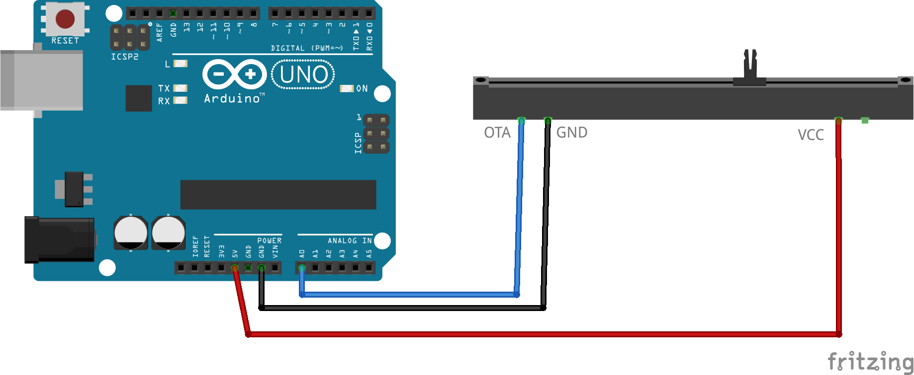
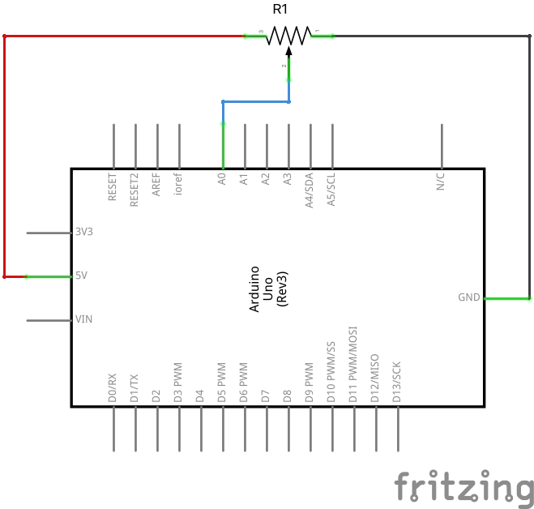

# Rakstīšana uz seriālā porta

Kad lietotājs slīdina potencometra regulatoru, 
izejā spriegums (starp **GND** un **OTA**) mainās. 
Arduino programmas šo vērtību var nolasīt un izmantot 
aprēķiniem (un ietekmēt kaut kādas citas ķēdes). 

Lai saprastu, kādas vērtības Arduino faktiski nolasīja, 
tās ir jāsūta uz parasto datoru (jo pašam Arduino nav pieslēgts 
monitors vai cita izvades iekārta). 
Parastākais risinājums ir tās sūtīt uz seriālo portu. 
Sprieguma vērtības var drukāt uz Arduino IDE ekrāna vai attēlot kā grafiku.

**Tools > Serial Monitor** un **Tools > Serial Plot** 
atvērs ekrānus, kuros ir redzamas vērtības. Piemēram, 

Potenciometra vērtības, ko var aizsūtīt uz analogo 
kontaktu (piemēram **A0**) ir skaitļi no 0 līdz 1023. 
Tiem atbilst spriegumu vērtības no 0V līdz 5V. 

**Maketēšanas shēma:** 

**Elektriskā shēma:**

