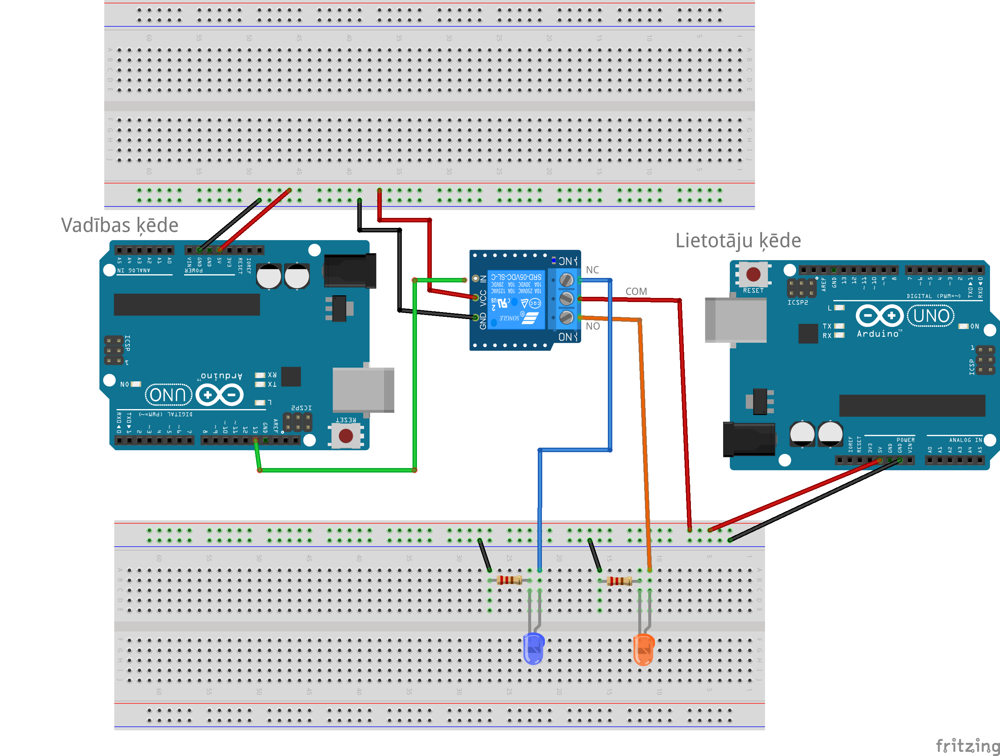
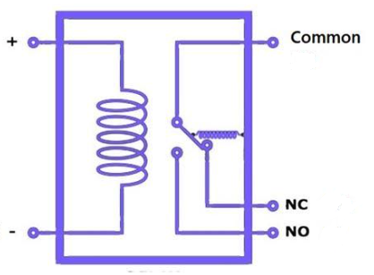

# Mirkšķināšana ar releju 

Arduino kontrolieris (izmantojot sensoru saņemtos datus) 
var izlemt ieslēgt vai izslēgt dažādas 
sadzīves elektroierīces - tsk. tādas, kuras izmanto "parasto maiņstrāvu"
un nemaz nav pieslēgtas Arduino 5V līdzstrāvai. 
Lai tas izdotos, ir nepieciešams relejs. 

Relejs vienlaikus darbojas divās pilnīgi nesaistītās 
elektrības ķēdēs. Vienā ķēdē darbojas Arduino kontrolieris 
un sūta relejam informāciju (kontaktus **GND** un **VCC** pieslēdz 
kā parasti pie Arduino **GND** un **5V**, bet kontaktu **IN** 
var pieslēgt pie jebkura )

1. Saslēgt shēmiņu (var kooperēties ar blakussēdētāju). 
   Var, protams, iztikt tikai ar vienu maketēšanas 
   plati un pat vienu Arduino kontrolieri nevis diviem. 
   Mūsu attēlā uzzīmētas divas plates un divi kontrolieri, lai uzsvērtu to, 
   ka rezistors ir vidū starp divām elektriskām ķēdēm. 
2. Aizsūtīt uz Arduino kontrolieri (kurš pieslēgts *kontroles ķēdei*)
   programmiņu **Blink** (no Arduino IDE var izvēlēties 
   **File** > **Examples** > **01.Basics** > **Blink**). 
   Šī programmiņa ieslēdz un izslēdz 13.kontaktu vienu reizi sekundē. 
3. Novērot, ka relejs sāk tikšķēt un pārslēdz uz patērētāju 
   ķēdes divas lampiņas. Tās pievienotas attiecīgi diviem kontaktiem: 
   
   * **NO** (normally open) ir tas 
     releja kontakts, kurš parasti nav savienots ar **COM** (bet var 
     pieslēgties, ja releju ieslēdz ar **IN**). 
   * **NC** (normally close) ir tas releja kontakts, kurš 
     parasti ir savienots ar **COM**, bet var tikt atvienots. 
     Nekad **NO** un **NC** nav ieslēgti (savienoti ar **COM**) vienlaikus.

## Elektromagnētiskais relejs

Relejs ir slēdzis. Par "releju" (*relay*) tradicionālajā angļu valodā sauca 
stafetes skrējienu. Relejs elektrotehnikā ir slēdzis - parasti tāds slēdzis, 
kur ar vāju strāvas stiprumu (piemēram 5V strāvu no Arduino) 
var ieslēgt vai izslēgt stiprāku strāvu (piemēram 220V maiņstrāvu kādam ārējam 
strāvas patērētājam). 

Elektromagnētisms nodrošina to, ka relejs spēj pievilkt klāt slēdža sviru. 
Slēdža pārslēgšanos uz vienu vai otru pusi var dzirdēt kā klusu tikšķi.

* Ja elektromagnēta spolei strāva nav pieslēgta (**Input** ir 0V jeb LOW), labajā pusē noslēdzas 
  ķēde starp **Contact** un **Normally close (NC)**. 
* Ja elektromagnēta spolei strāva ir pieslēgta (**Input** ir 5V jeb HIGH), labajā 
  pusē noslēdzas ķēde starp **Contact** un **Normally Open (NO)**. 

