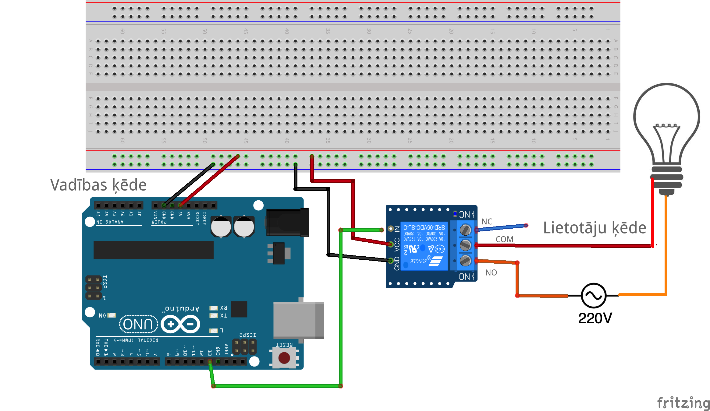
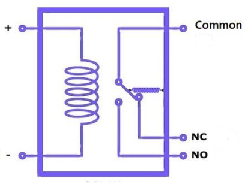

# Morzes signāli 

Šajā vingrinājumā ultraskaņas sensors (mēra attālumu ar ultraskaņu) 
iedarbina vienkāršu elektrisku ķēdi, kas mirkšķina LED lampiņu. 
Tā kā par lampiņām mums ir bijuši jau daudzi vingrinājumi, 
cenšamies tās mirkšķināt interesantāk, sūtot Morzes signālus. 

**Variants bez releja:**

Ja Jūsu komplektā nav releja, tad izvades kontaktu (pin 13) 
var pieslēgt pie LED lampiņas tieši (virknē ar $220~\Omega$ rezistoru). 

**Variants ar releju:** 

Ja nepieciešams miršķināt Morzes signālu spēcīgāk nekā atļauj 5V Arduino 
mikrokontrolieris, tad var izmantot releju, kurš ļauj ieslēgt/izslēgt 
ārēju elektrisku ķēdi. Piemēram, lampiņu kura pieslēgta pie blakussēdētāja 
Arduino kontroliera. Vai arī, teiksim, galda lampu (jo relejs spēj darbināt arī 
$220~\text{V}$ ķēdi ar daudz lielāku spriegumu tsk. maiņstrāvu). 

Releja darbības loģika ir sekojoša - ja ievadē spriegums ir HIGH (5V), 
tad relejs saslēdz kontaktu ar 

## Elektromagnētiskais relejs

Relejs ir slēdzis. Par "releju" (*relay*) tradicionālajā angļu valodā sauca 
stafetes skrējienu. Relejs elektrotehnikā ir slēdzis - parasti tāds slēdzis, 
kur ar vāju strāvas stiprumu (piemēram 5V strāvu no Arduino) 
var ieslēgt vai izslēgt stiprāku strāvu (piemēram 200V maiņstrāvu kādam ārējam 
strāvas patērētājam). 

Elektromagnētisms nodrošina to, ka relejs spēj pievilkt klāt slēdža sviru. 
Slēdža pārslēgšanos uz vienu vai otru pusi var dzirdēt kā klusu tikšķi.

* Ja elektromagnēta spolei strāva nav pieslēgta (**Input** ir 0V jeb LOW), labajā pusē noslēdzas 
  ķēde starp **Contact** un **Normally close (NC)**. 
* Ja elektromagnēta spolei strāva ir pieslēgta (**Input** ir 5V jeb HIGH), labajā 
  pusē noslēdzas ķēde starp **Contact** un **Normally Open**. 

## Morzes kodējums

.
Ap 1837.g. Samuels Morze izstrādāja šo sistēmu. 
1844.g. Baltimoras-Vašingtonas telegrāfa līniju atvēra, sūtot 
ziņojumu "What hath God wrought" ("ko Dievs dara" vai 
"ko Dievs ir sastrādājis" - sal. 4.Mozus grāmata 23:23:
"Jo zīlēšana neder pret Jēkabu un buršana neder pret Israēli. 
Savā laikā Jēkabam top sacīts un Israēlim, *ko Dievs dara*.").
Tā kļuva par ASV telegrāfa sistēmu, ko sauca arī par "dzelzceļa Morzes kodu". 

Mēs izmantojam starptautisko versiju, ko 
izstrādāja Frīdrihs Klemenss Gerke 1848.g.; 
to sākumā izmantoja telegrāfa savienojumiem Vācijā, bet vēlāk arī 
visur citur pasaulē.

Morzes koda sūtīšanas ātrums mēdz atšķirties. Mūsu piemēros: 

* Īsās svītras garums 0.1 sekunde. 
* Garās svītras garums 0.3 sekundes (jābūt 3x garākai par īso svītru). 
* Pauze starp viena burta svītrām: 0.1 sekunde (tikpat cik īsā svītra). 
* Pauze starp burtiem 0.3 sekundes (3x garāka par īso svītru). 
* Pauze starp vārdiem 0.7 sekundes (7x garāka par īso svītru).

