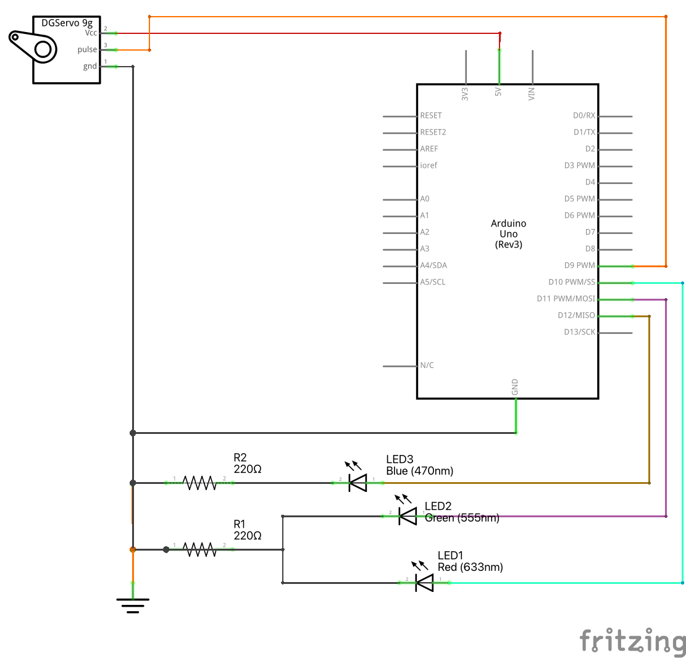
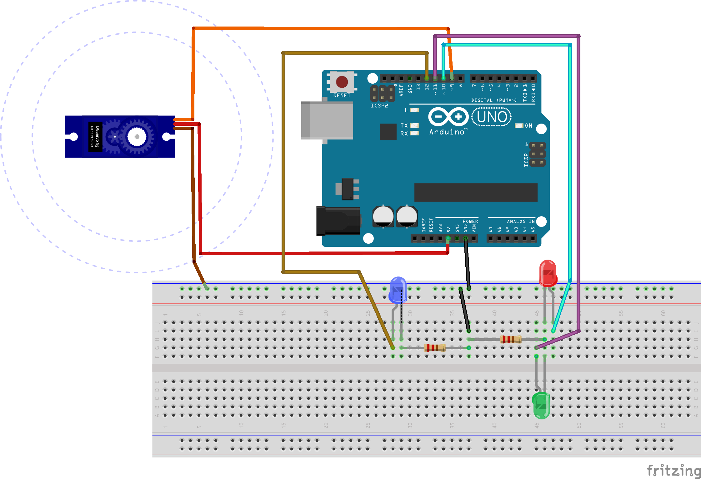

# Motora pagriezieni par noteiktiem leņķiem

Šajā piemērā ir saslēgta ķēde, kura cikliski dod vienas un tās 
pašas 4 komandas servo motoram:  
**(1)** Pagriezties par $10^{\circ}$ pretēji pulksteņa rādītājiem (leņķis ``LEFT_POS`` jeb $80^{\circ}$); 
**(2)** Nostāties "neitrālā" vidus pozīcijā (leņķis ``NEUTRAL_POS`` jeb $90^{\circ}$)
**(3)** Pagriezties par $10^{\circ}$ pulksteņa rādītāju virzienā (leņķis ``RIGHT_POS`` jeb $100^{\circ}$)

Servo motora griešanās ātrumu nevar tieši kontrolēt; SG90 ražotājs 
to parasti uzstāda 0.1 sekundes (jeb sekundes desmitdaļa), lai pagrieztos 
par $60^{\circ}$. Tā kā mūsu pagriezieni par $10^{\circ}$ ir vēl mazāki, 
tad ar $1000$ milisekunžu (jeb vienas sekundes) pauzēm starp pagriezieniem 
vajadzētu pietikt, lai motors nostātos vajadzīgajā stāvoklī. 

Elektriskajā shēmā ir pieliktas arī trīs diodes: 

A. Sarkana diode norāda, ka motors griežas virzienā uz ``RIGHT_POS``
B. Zaļa diode norāda, ka motors griežas virzienā uz ``LEFT_POS``
C. Zila diode norāda, ka motors atgriežas neitrālajā stāvoklī jeb ``NEUTRAL_POS``. 

Uz sarkano un zaļo diodi ir kopīgs $220~\text{\Omega}$ rezistors, 
bet zilajai diodei ir pašai savs. 

Elektriskā shēma:

Maketēšanas plates attēls:

