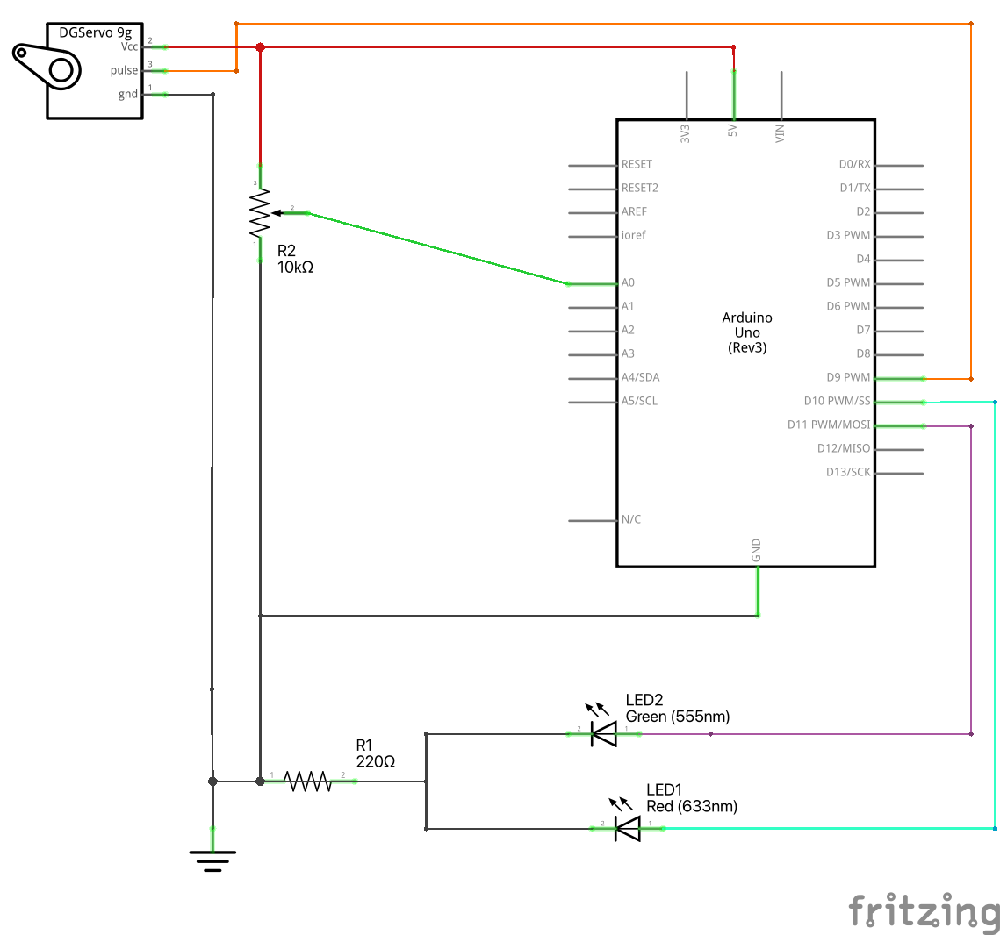

# Motora grozīšana ar potenciometru

Var izdomāt arī tādu iepriekšējā darba [PositionSequence](../PositionSequence) variantu, 
kurā stāvokļu secība nav iepriekš noteikta, bet lietotājs var bīdīt 
potenciometra regulatoru - un Arduino uz to reaģē, griežot motoru 
uz vienu vai uz otru pusi. 

Ja motors griežas uz tādu leņķa vērtību, kas lielāka par 90 grādiem, iededz sarkanu LED, 
ja uz vērtību, kas mazāka par 90 grādiem, tad uz otru LED. 

Šādi izskatās elektriskā shēma:

Šādi izskatās maketēšanas plate:

