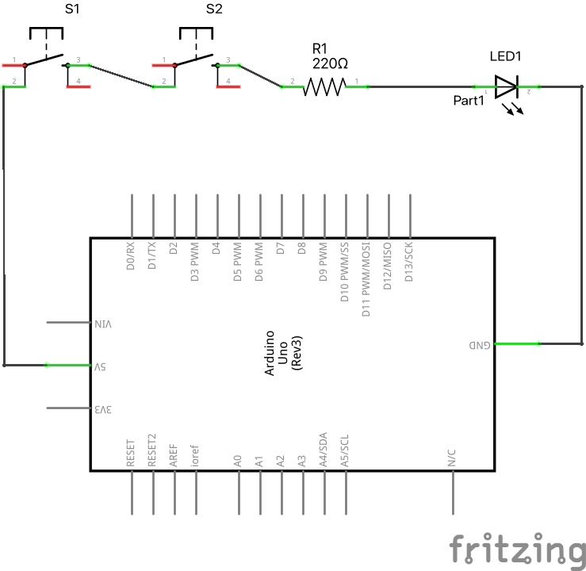
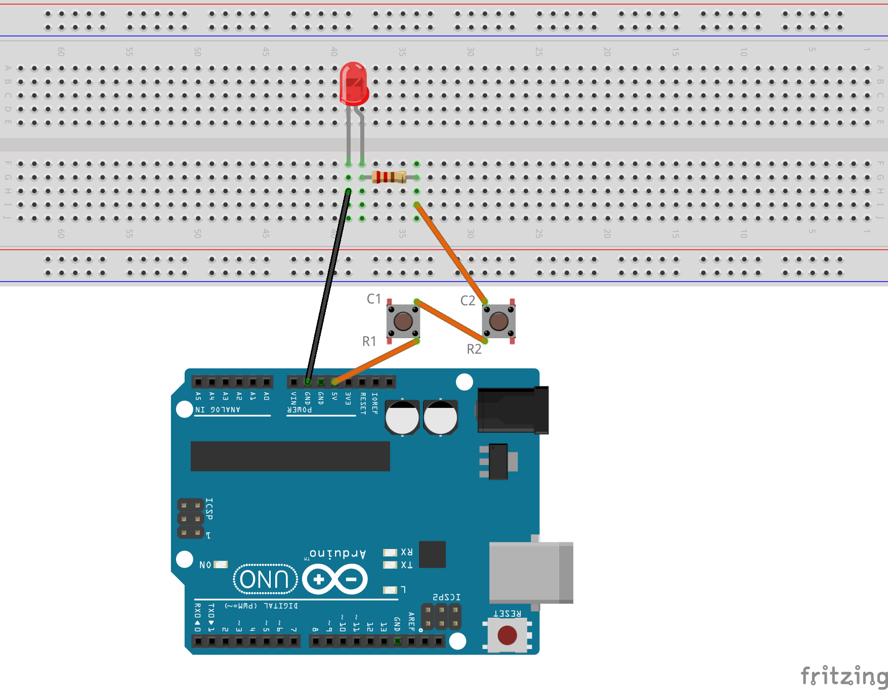
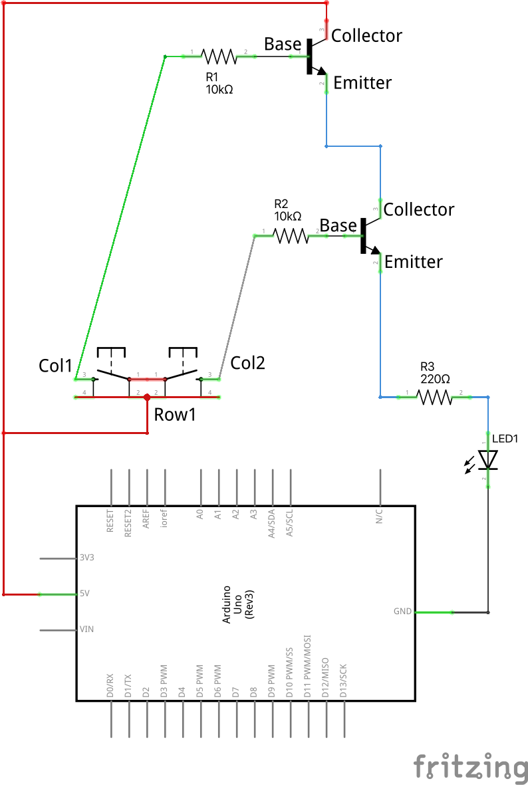
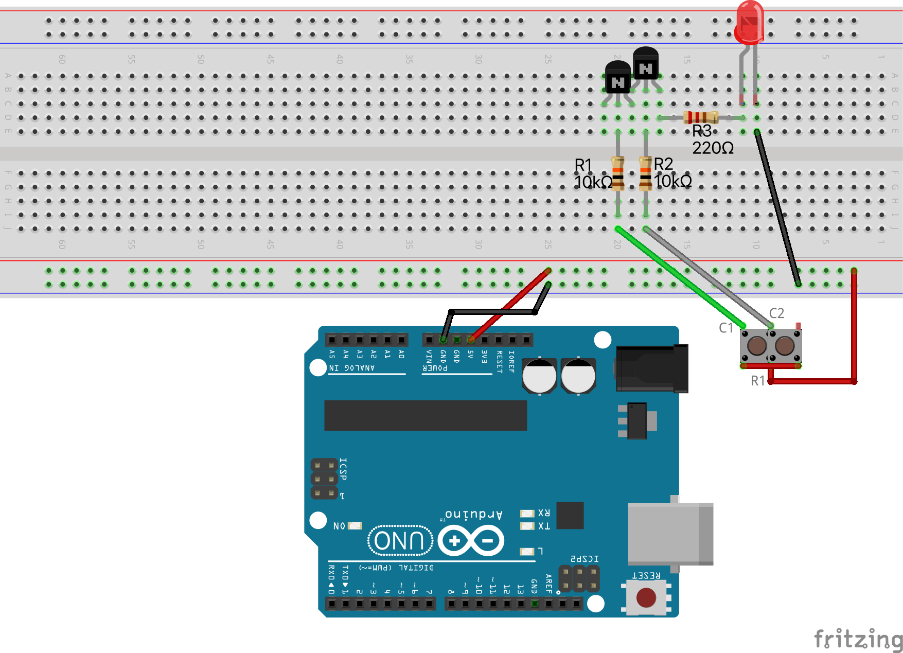

# Loģiskā AND ķēde

``AND`` ir Būla operācija, kas darbojas ar vērtībām 
1 un 0 (jeb Patiess/True un Aplams/False). Tā aprēķināšanai 
ir izmantojama šāda tabula: 

<table>
<tr><th>A</th><th>B</th><th>(A AND B)</th></tr>
<tr><td>False</td><td>False</td><td>False</td></tr>
<tr><td>False</td><td>True</td><td>False</td></tr>
<tr><td>True</td><td>False</td><td>False</td></tr>
<tr><td>True</td><td>True</td><td>True</td></tr>
</table>

Darbības "A AND B" rezultāts ir 1 (jeb True) tad un tikai tad, ja
gan A, gan B abi ir 1 (jeb True). 
Visos citos gadījumos "A AND B" ir aplams.

## AND ķēde ar divām pogām

**Šim praktiskajam darbam nav nepieciešams augšupielādēt programmu no Arduino IDE. Vajadzīgs jebkāds 5V strāvas avots. Kā strāvas avotu var izmantot Arduino kontaktus "GND" un "5V".**

Elektriskā shēma:

Maketēšanas attēls:

