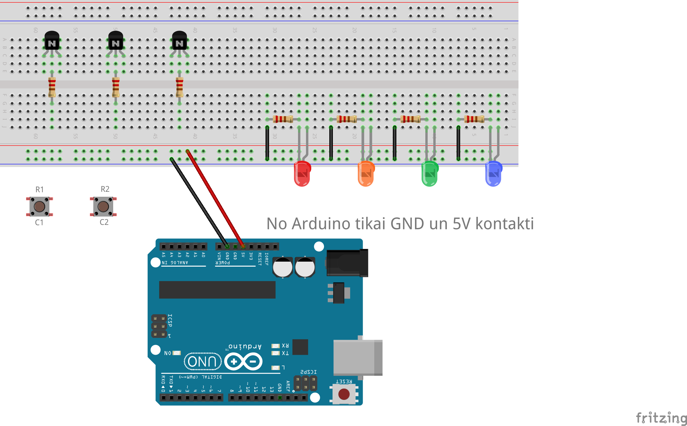

# Sazarošanās ķēde

Šajā vingrinājumā ilustrējam, kā divas podziņas S1 un S6 dažādās kombinācijās 
var kontrolēt četras lampiņas.
(Pogām S1, S6 var pieslēgt **C1,C2,R1,R2** kontaktus no podziņu matricas pie 
maketēšanas plates.)

**Vajadzīgā uzvedība:**

1. Ja nav nospiestas ne S1 (pirmā podziņa pirmajā rindā), ne S6 (otrā podziņa otrajā rindā), 
   tad deg sarkanā LED lampiņa. 
2. Ja nospiesta S1, bet nav nospiesta S6, tad deg oranžā LED lampiņa. 
3. Ja nav nospiesta S1, bet ir nospiesta S6, tad deg zaļā LED lampiņa. 
4. Ja nospiestas gan S1, gan S6, tad deg zilā lampiņa. 

Šādu uzvedību varētu panākt, programmējot pašu Arduino (lietojot
divus digitālos kontaktus "INPUT" režīmā, bet četrus kontaktus "OUTPUT" režīmā - un, protams, 
arī dažādos citos veidos). 
Bet šoreiz Arduino netiek programmēts vispār. Vēlamo uzvedību toties var nodrošināt, 
izmantojot komplektā esošos NPN tranzistorus. 
Šeit ir (nepabeigta) elektriskā shēma:

**Vadlīnijas:** 

1. Arduino pieslēgti tikai **GND** un **5V** 
2. Podziņu matricā var izmantot tikai podziņas **S1** un **S6**; citas 
   podziņas izmantot nedrīkst. 
3. Var izmantot cik patīk (līdz 5) tranzistoriem. Parasti pietiks ar 2 vai ar 3 tranzistoriem.
4. Katram tranzistoram bāzi (vidējo kontaktu) pieslēdz pie jebkādas strāvas 
   tikai caur 1 vai 10 kiloomu rezistoru (nokrāsoti sarkani vai melni)
5. Katru LED lampiņu pieslēdz virknē ar 220 omu rezistoru (gaiši zili). 

Var izmantot savienojumiem vadus, cik nepieciešams. 