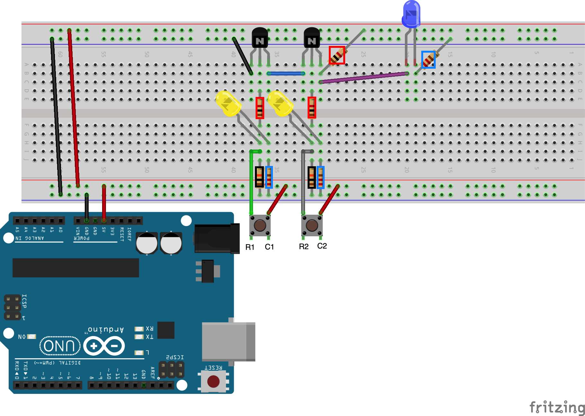

# Loģiskā NAND ķēde

``NAND`` ir Būla operācija, kas darbojas ar vērtībām 
1 un 0 (jeb Patiess/True un Aplams/False).
Mēģiniet nospiest podziņas dažādās kombinācijās. 
**S1** un **S6** podziņām uz 4x4 podziņu matricas galvenās diagonāles
vajadzētu iedegt dzeltenās LED lampiņas. 
Pierakstiet rezultātu - kāds ir zilās lampiņas rezultāts 
pēc loģiskās operācijas beigām. 

Vajadzētu sanākt NAND (negācijai no AND) - t.i. 
zilā lampiņa deg vienmēr, izņemot situāciju, kad abas 
podziņas **S1** un **S6** ir nospiestas.

<table>
<tr><th>A</th><th>B</th><th>(A NAND B)</th></tr>
<tr><td>0</td><td>0</td><td>1</td></tr>
<tr><td>0</td><td>1</td><td>1</td></tr>
<tr><td>1</td><td>0</td><td>1</td></tr>
<tr><td>1</td><td>1</td><td>0</td></tr>
</table>

**Šim praktiskajam darbam nav nepieciešams augšupielādēt programmu no Arduino IDE. Vajadzīgs jebkāds 5V strāvas avots. Kā strāvas avotu var izmantot Arduino kontaktus "GND" un "5V".**

## Vingrinājuma varianti

1. Vai NAND ķēdes izvadi var izmantot tikai LED lampiņas iedegšanai, 
   vai arī tā var kļūt par ievadi citās Būla ķēdēs? 
   Piemēram, vai var uzbūvēt parasto AND ķēdi, izmantojot 
   NAND ķēdi un NOT ķēdi un šādu formulu: 

   $$\overline{(A \uparrow B)} = A \land B.$$