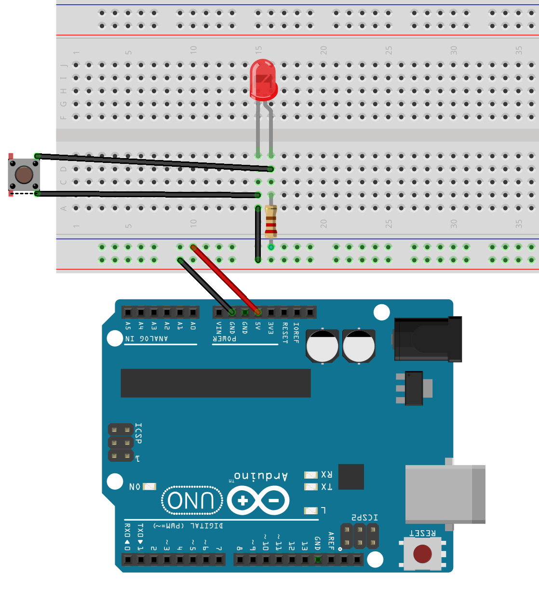
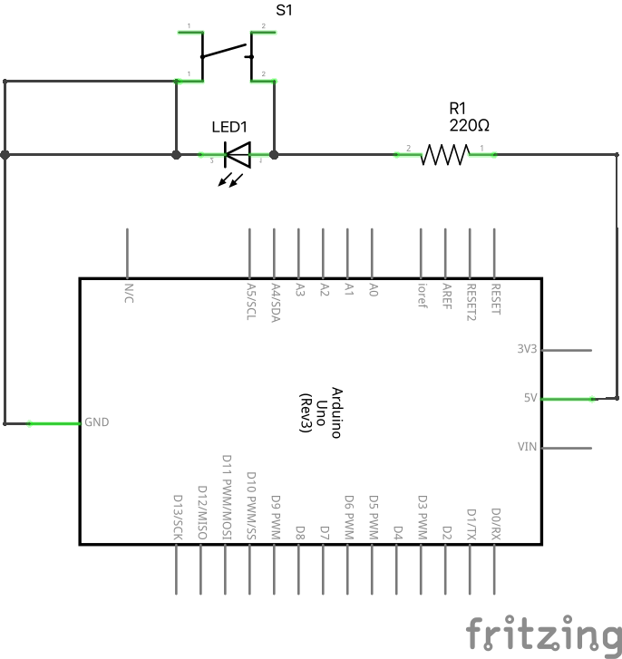
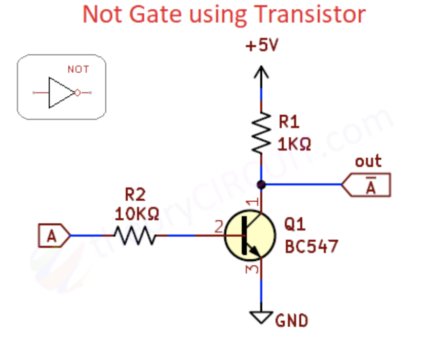

# Loģiskā NOT ķēde

Negācija (NOT) ir vienvietīgs operators; to pielieto tikai vienam 
Būla mainīgajam. Tas apgriež izteiksmes patiesuma vērtību. 

<table>
<tr><th>A</th><th>(NOT A)</th></tr>
<tr><td>False</td><td>True</td></tr>
<tr><td>True</td><td>False</td></tr>
</table>

Loģikas piemēri parastās valodas teikumos: 

* Negācija no "šonakt bija sniegs" ir "šonakt nebija sniega". 
* Negācija no "$x > 3$" (mainīgais $x$ lielāks par $3$) ir $x \leq 3$ 
  ($x$ nav lielāks par $3$ jeb *nepārsniedz* $3$). 
* Negācija no "Visi šodien bija skolā" ir "Visi šodien nebija skolā" jeb 
  "Eksistē kāds, kurš nebija skolā". 
* Negācija no "Neviens šodien nebija skolā" ir "Atradīsies kāds, kurš 
  šodien bija skolā".

## NOT ķēde ar vienu pogu

Ar pogām vai slēdžiem uztaisīt NOT ķēdi varētu šķist savādi - LED diodei 
jāpārstāj degt tieši tad, kad pogu nospiež (jeb savieno jaunu vadu). 
To var panākt, ja apkārt LED diodei izveido "apvedceļu" ar daudz mazāku pretestību. 
Šajā gadījumā abos LED diodes galos būs vienāds spriegums un tā nedegs.
(Šāda risinājuma vājā vieta ir tā, ka ķēde patērē strāvu arī tad, kad 
LED lampiņa ir izslēgta, jo cauri pretestībai joprojām plūst strāva.)

<table>
  <tr>
    <td></td>
    <td></td>
  </tr>
</table>

## NOT ķēde ar vienu transistoru

Izmantota shēma no [theorycircuit.com](https://theorycircuit.com/digital-electronics/design-logic-gates-using-transistors/): 

## Jautājumi 

1. Vai ir pamatoti teikt, ka NOT ķēde ar pogu izraisa ķēdē īsslēgumu? 
2. Kurā situācijā ķēde patērē vairāk jaudas -- tad, kad LED diode 
   deg vai arī tad, kad LED diode nedeg? 
   
*Piezīme:* Patērēto enerģiju iegūst pēc formulas 
$P = UI$, kur $P$ ir jauda (*power*), $U$ ir spriegums (*voltage*), 
bet $I$ ir strāvas stiprums (*current*). 
