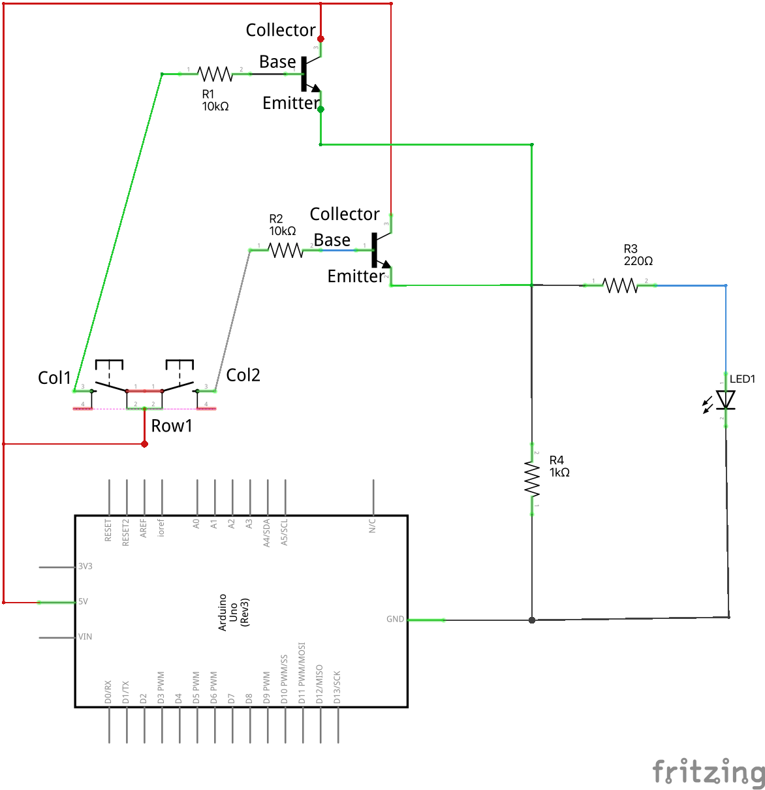
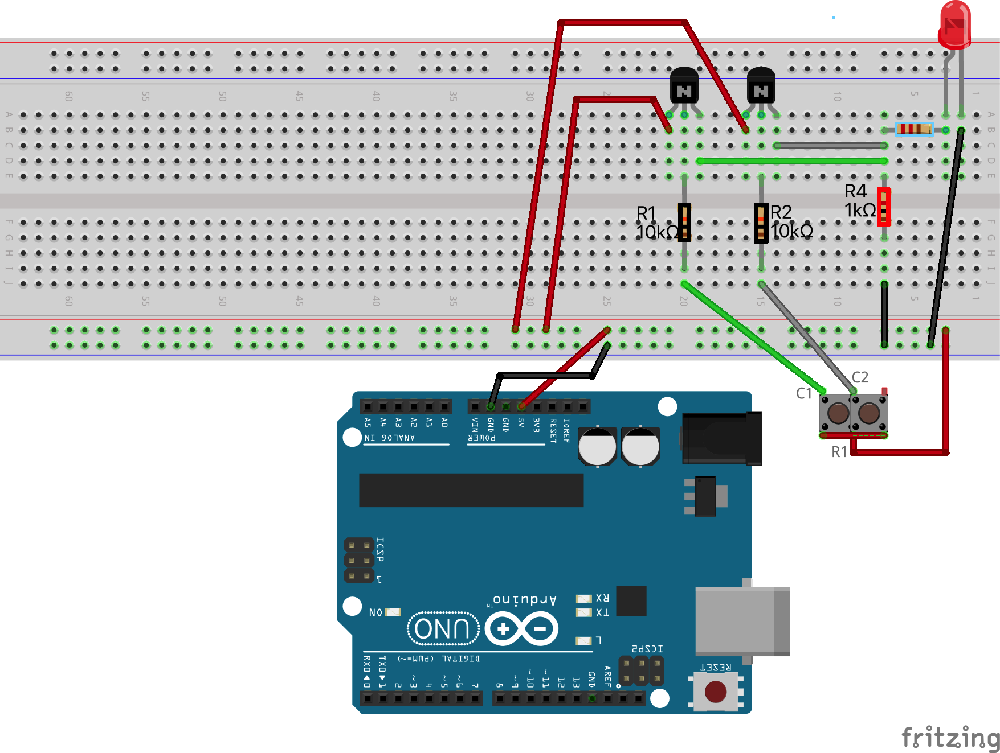

# Loģiskā OR ķēde

``OR`` ir Būla operācija, kas darbojas ar vērtībām 
1 un 0 (jeb Patiess/True un Aplams/False). Tā aprēķināšanai 
ir izmantojama šāda tabula: 

<table>
<tr><th>A</th><th>B</th><th>(A OR B)</th></tr>
<tr><td>False</td><td>False</td><td>False</td></tr>
<tr><td>False</td><td>True</td><td>True</td></tr>
<tr><td>True</td><td>False</td><td>True</td></tr>
<tr><td>True</td><td>True</td><td>True</td></tr>
</table>

Darbības "A AND B" rezultāts ir 1 (jeb True) tad un tikai tad, ja
vismaz viens (vai varbūt arī abi divi) kontakti ir 1 jeb True. 
Mūsu gadījumā lampiņa iedegas tad, ja nospiež vienu (jebkuru) no 
abām podziņām vai arī nospiež tās abas.

## OR ķēde ar divām pogām

OR ķēdi arī var izveidot līdzīgi kā AND ķēdi - izmantojot tikai 
pogas/slēdžus, vadus un lampiņas. 
Šajā gadījumā pogas/slēdži jāsaslēdz nevis virknē, bet paralēli 
(nospiežot jebkuru no abām pogām, elektriskā ķēde aizveras). 

**Šim praktiskajam darbam nav nepieciešams augšupielādēt programmu no Arduino IDE. Vajadzīgs jebkāds 5V strāvas avots. Kā strāvas avotu var izmantot Arduino kontaktus "GND" un "5V".**

## OR ķēde ar diviem transistoriem

Elektriskā shēma:

Maketēšanas attēls:

