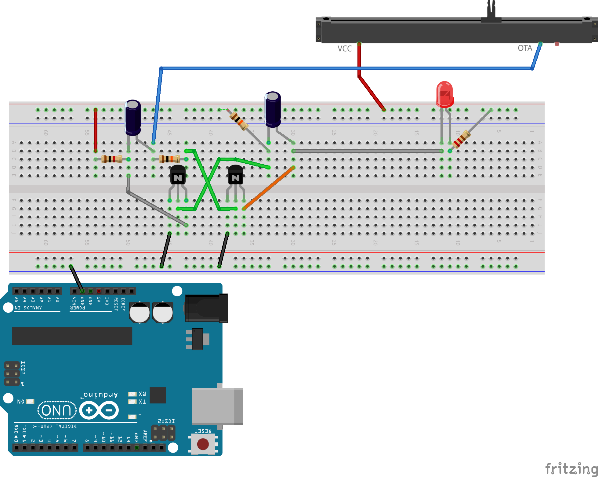

# Oscilators

Arduino kontakti **GND** un **5V** nodrošina līdzstrāvu.
Oscilators ir tāda elektriska ķēde, kurā visu laiku notiek svārstības. 
Šis darbs atkārto video YouTube: [Two Transistor Oscillator](https://youtu.be/NP3YDbRbXzY?si=l7iJT8M26Z5lLWia). 

Elektriskā shēma: 

Maketēšanas shēma:

Šajā shēmā ieslēdzot $100~\mu{}F$ (100 mikrofarādu) kondensatorus, 
elektrības signāls svārstās lēni (dažas reizes sekundē)
un to var attēlot ar LED lampiņu. 

Kondensatoram viena kāja ir garāka par otru - lai būtu vieglāk ievietot 
diagrammā, ieteicams, garāko kāju izlocīt tā, lai tā novirzītos drusku 
uz sāniem (un būtu vienādā augstumā ar īsāko kāju). 
Ja potenciometru bīda uz vienu pusi, tad svārstību frekvence mainās un 
pēc kāda laika LED lampiņa sāk spīdēt nepārtraukti.

Lai LED atkal sāktu mirkšķināt, potenciometru aizbīda uz sākumu. 
Ja tas nepalīdz, kreisajam kondensatoram var nomest lādiņu (savienot abus 
tā polus). Var arī pārstartēt ķēdi. 

Ja ieliek mazāku kondensatoru (tikai 10 mikrofarādus), tad LED lampiņa 
mirkšķina ļoti strauji. Arī šajā gadījumā potenciometrs var izmainīt
LED mirkšķēšanas frekvenci vai panākt, lai lampiņa degtu visu laiku.

## Vingrinājuma varianti

1. Uzzīmēt kolektora-emitera strāvas stipruma svārstības abos 
   tranzistoros ar osciloskopu.  
2. Kur pievienot shēmai otru diodi, lai varētu novērot 
   pretējas svārstības, ko rada abi tranzistori. 