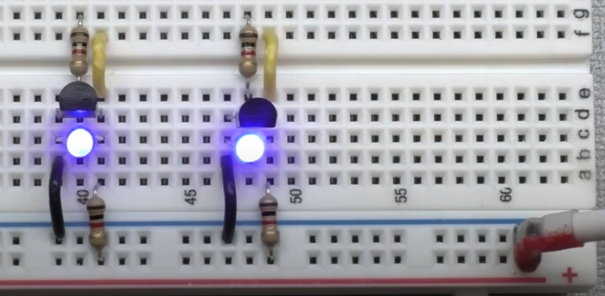
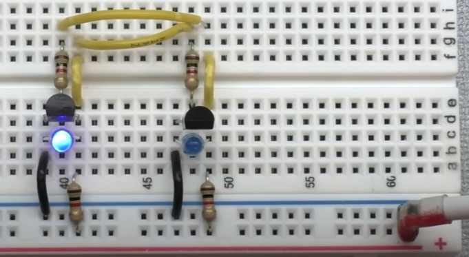

# SR Trigera ķēdes

Divus NOT elementus var novietot blakus vienu otram: 

Normālos apstākļos lampiņas ir ieslēgtas. Bet tad, ja rezistoru pašā 
augšā (tranzistora bāzi) savieno ar **5V**, lampiņa nodziest. 

Paradoksāla situācija izveidojas tad, ja abus NOT elementus savieno tā, lai 
tie var viens otru izslēgt. Šādai sistēmai ir divi stabili stāvokļi
(deg vai nu kreisā vai labā LED spuldzīte, bet ne abas): 

Lai pārslēgtu šo sistēmu no viena stāvokļa otrā, vajag iedot signālu 
tā tranzistora bāzei, kura pusē gribam izslēgt lampiņu. 
