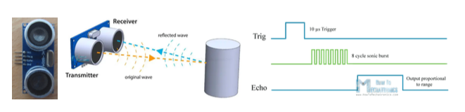
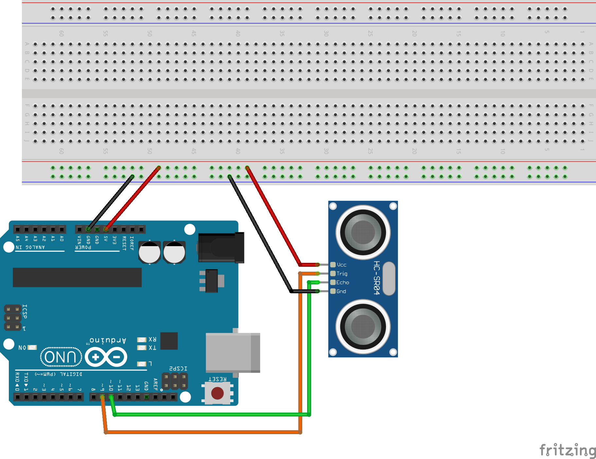
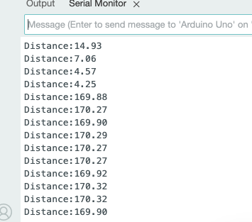

# Attāluma rakstīšana uz seriālo portu

Ultraskaņas sensors faktiski satur divus sensorus, kas 
balstīti uz pjezokristālu: dažu desmitu voltu iespaidā 
viens kristāls var sūtīt ultraskaņas impulsu, un otrs 
kristāls šo ultraskaņu pārvērš atpakaļ par elektrisko spriegumu.
Sensors HC-SR04 izmēra laiku starp nosūtīšanu un saņemšanu mikrosekundēs.
Zinot skaņas ātrumu gaisā, var izrēķināt attālumu līdz šķērslim 
centimetros. 

Šī vienkāršā shēmiņa pieslēdz HC-SR04 pie Arduino kontroliera
un drukā attālumu, pārveidotu centimetros, uz seriālo portu. 

Lai redzētu attālumus, vajag nosūtīt programmiņu un pēc tam 
atvērt **Tools** > **Serial Monitor**. 

## Uzdevumi

1. Programmas pašā augšā izveidot skaitītāju (`int count = 0;`), 
   kuru palielina ikreiz, kad ultraskaņas sensors nomērījis 
   attālumu, kas nepārsniedz 10 centimetrus. Izvadīt šī skaitītāja 
   vērtību blakus sensora nomērītajai vērtībai. 
   (Var arī nedaudz sarežģītāku šī uzdevuma variantu: Tos gadījumus, 
   kad roka uzkavējas ilgi sensora tuvumā, ieskaitīt tikai vienreiz. 
   Lai to izdarītu, jāatceras divas iepriekšējās sensora vērtības; 
   skaitītāju palielina tikai tad, ja roka pirms 500 milisekundēm bija ārpus 10 centimetru 
   zonas un tikai tagad iegāja 10 centimetru zonā.)
2. Pievienot shēmai kādu interesantāku izvadi - piemēram, 
   Passive Buzzer (dūcēju), kas ieslēdzas tad, ja Ultraskaņas 
   sensora nomērītais attālums ir starp $1~\text{cm}$ un $50~\text{cm}$. 
   Un izvadītā frekvence uz dūcēja ir apgriezti proporcionāla attālumam. 
   Piemēram, attālumam $1~\text{cm}$ atbilst $10~\text{kHz}$ (10 kiloherci - 
   diezgan augsta, spalga skaņa), 
   bet attālumam $50~\text{cm}$ atbilst $200~\text{Hz}$ (zema skaņa).

