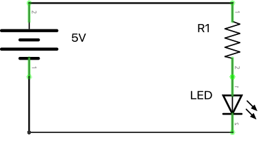
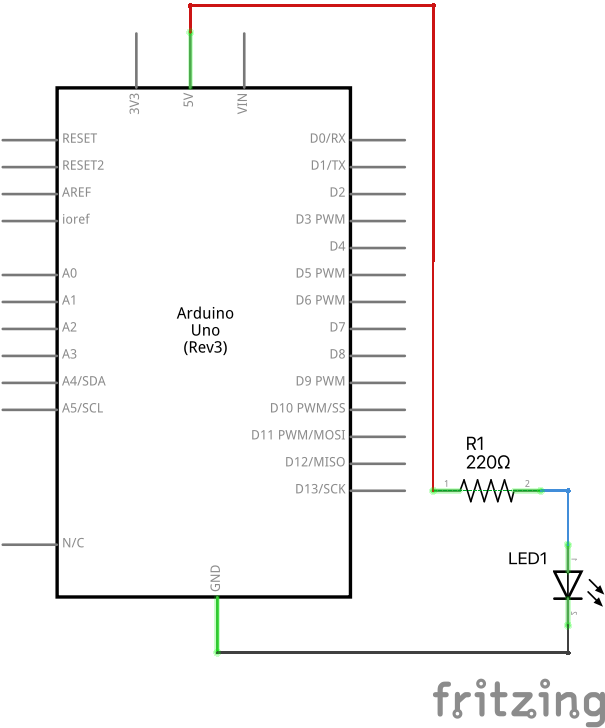
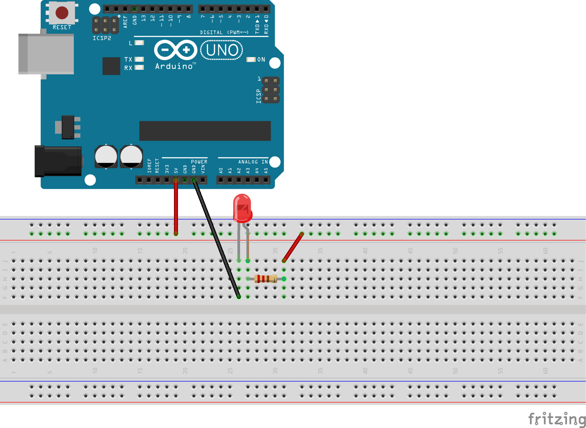
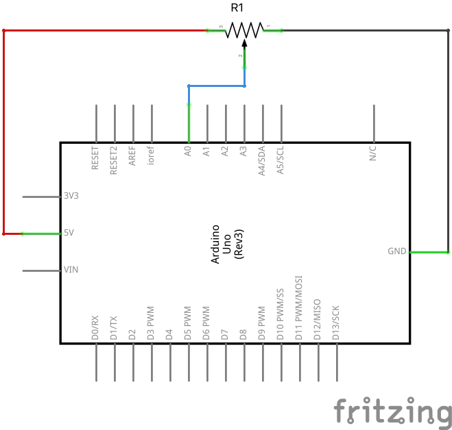
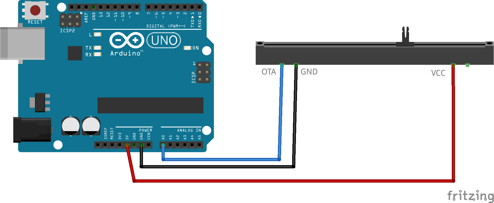

Oma likums. Diodes. C++ datu tipi. 
=================================================

Praktiskais darbs #1 (Blink.ino)
---------------------------------

**Vajadzīgās detaļas:** Arduino kontrolieris, USB vads (adapteris no USB-A uz USB-B).

1. Palaist Arduino IDE. Atvērt izvēlni **File > Examples > 01.Basics > Blink**.
   Saglabāt ``Blink.ino`` starp saviem failiem ar **File > Save As**. Piemēram, 
   ``C:\Users\MansVards\Arduino\Blink\Blink.ino`` (skripts jāliek direktorijā 
   ar to pašu nosaukumu). 
2. Izvilkt no kastītes kontrolieri un USB vadu. Vienu USB galu pievienot datoram, 
   otru galu pievienot Arduino platei. 
   Pārliecināties, ka uz plates iedegas diode **ON**.
3. Uzstādīt kontroliera tipu un portu. Arduino IDE
   atvērt **Tools > Board > Arduino AVR Boards > Arduino Uno** un 
   arī **Tools > Port > usb.serial** (vai **Tools > Port > Com**, ja nav minēts USB).
4. Kompilēt programmiņu ar **Sketch > Verify/Compile**.
5. Nosūtīt programmiņu uz Arduino: **Sketch > Upload**. 
   Pārliecināties, ka lampiņa **L** (cita diode uz Arduino plates) sāk mirkšķināt, 
   ik pēc sekundes ieslēdzoties vai izslēdzoties.

   .. literalinclude:: ../../sandbox/KalvisA/ControllerAlone/Blink/Blink.ino
      :language: cpp

6. ``LED_BUILTIN`` vienāds ar ``13`` (jo iebūvēto diodi iededz 13.kontakts uz plates).
   Pārliecinieties par to, ``LED_BUILTIN`` visur aizstājot ar skaitli ``13`` un nosūtot 
   programmu uz Arduino vēlreiz.

* **Pārbaudīt maksimālo spriegumu/strāvu:** Nepārsniegt atļautos voltus/ampērus. 
  LED slēgt pie :math:`5~\text{V}` tikai kopā ar rezistoru.
* **Lietot iezemējumu:** Katra ierīce ir savienota ar Arduino **GND**; nevajag veidot 
  ķēdes starp nepazīstamiem Arduino kontaktiem. Nevajag saslēgt Arduino kontaktus uz īso.
* **Atslēgt USB, ja maina ķēdi:** Ķēdi jāpārbauda pirms pieslēdz strāvu; nevajag pārspraust 
  vadiņus tad, ja shēma ir pieslēgta USB vadam.
* **Tīras rokas:** Rokām jābūt sausām un uz darba galda neturēt ēdamo. (Pēc nodarbības, 
  pēc pieskaršanās metāla kontaktiem un lodējumiem vajag nomazgāt rokas.)

Elektrotehnika Arduino un LED saslēgšanai
-----------------------------------------------

Lai droši lietotu LED ar Arduino, jāizmanto rezistors. 
Tas neļauj LED caurlaist pārāk lielu strāvu, kas to var sabojāt.

**Oma likums:**

  - **Spriegums (U):** Līdzīgi kā ūdens spiediens caurulē vai ūdenskrituma augstums.
  - **Strāvas stiprums (I):** Līdzīgi kā ūdens plūsmas ātrums.
  - **Pretestība (R):** Pretojas strāvas plūsmai, līdzīgi kā caurules sašaurinājums ūdenim.

  Oma likums: :math:`I = \frac{U}{R}`. 
  Maza pretestība nozīmē ļoti lielu strāvas stiprumu (*īsslēgums*). 

.. list-table:: 
   :widths: 65 35
   :align: center
   :header-rows: 0

   * - **Virknes slēgums:** Ja ierīces saslēdz virknē, tad to kopējā pretestība ir visu ieslēgto pretestību summa: :math:`R = R_1 + R_2 + \ldots`. Viena un tā pati strāva plūst caur visām ierīcēm, bet sprieguma kritums uz katras ierīces ir proporcionāls tās pretestībai. Izņēmums ir diode, kurai (no garākās kājiņas uz īsāko) pretestība ir niecīga, bet sprieguma kritums ir aptuveni :math:`2` volti.
     - |led-and-resistor|

  

**Pretestības aprēķināšana:**
  Ja pieslēdz LED ar :math:`2~\text{V}` sprieguma kritumu un maksimālo strāvu 
  :math:`20~\text{mA}` (20 miliampēri jeb :math:`0.020~\text{A}`) Arduino platei ar :math:`5~\text{V}` 
  spriegumu, no strāvas avota sprieguma jāatņem LED sprieguma kritums. 
  Uz rezistoru :math:`R_1` spriegums ir :math:`5~\text{V} - 2~\text{V} = 3~\text{V}`. 
  Izmantojam Oma likumu :math:`R = \frac{U}{I}` un atrodam 
  :math:`R = \frac{3~\text{V}}{0.020~\text{A}} = 150~\Omega`.

  Var izmantot arī :math:`220~\Omega` rezistoru no komplekta, kas vēl drusku samazinās 
  strāvas stiprumu. Šādā ķēdē LED droši darbojas kopā ar Arduino!

Praktiskais darbs #2: Ārēja LED diode (Blink.ino)
----------------------------------------------------

**Vajadzīgās detaļas:** Arduino kontrolieris, USB vads, maketēšanas plate (*breadboard*), 
krāsaina LED diode, :math:`220~\Omega` rezistors, 
divi savienotājvadi M-M (ar adatiņām abos galos).

Šajā darbā scenārijs joprojām ir ``Blink.ino``, bet pievienosim ārēju diodi. 

.. list-table:: 
   :widths: 30 70
   :align: center
   :header-rows: 0

   * - |practical2-circuit1_schem|
     - |practical2-circuit1_bb|

1. Atvienot Arduino kontrolieri no USB vada. 
   Saslēgt attēlā redzamo ķēdi. LED garāko kājiņu likt tuvāk plusam, īsāko -- tuvāk mīnusam. 
   (**Uzmanību:** *Pārliecinieties, ka diode un rezistors ir saslēgti virknē, lai 
   nepārsniegtu maksimālo strāvas stiprumu uz ārējās LED.*)
2. Pievienot Arduino kontrolieri USB vadam. Pārliecināties, ka 
   tagad mirkšķinās gan mazā diode **L** uz Arduino plates, gan arī 
   F5 gaismas diode mūsu ķēdē.

Praktiskais darbs #3: Potenciometrs (ReadingValues.ino)
-----------------------------------------------------------

**Vajadzīgās detaļas:** Arduino kontrolieris, USB vads, potenciometrs, maketēšanas plate, 
trīs vadiņi M-F (ar adatiņu vienā galā un kontaktligzdu otrā), 
divi vadiņi M-M (ar adatiņām abos galos).

1. Atvienot vadus no Arduino uz ārējo gaismas diodi LED.
   Ieslēgt potenciometru starp **GND** un **5V** (potenciometra **VCC**), izvadu 
   **OTA** savieno ar Arduino **A0**. 

   .. list-table:: 
      :widths: 30 70
      :align: center
      :header-rows: 0

      * - |potentiometer_schem|
        - |potentiometer_bb|

2. Izveidot jaunu skriptu, saglabāt to kā ``ReadingValues.ino``

   .. literalinclude:: ../../sandbox/KalvisA/PotentiometerHW233/ReadingValues/ReadingValues.ino
      :language: cpp

3. Kompilēt un nosūtīt šo skriptu uz Arduino. 
   Novērot strauju **RX** (seriālā porta) lampiņas mirkšķināšanu.

4. No Arduino IDE atvērt **Tools > Serial Monitor**. Pārliecināties, ka uz 
   datora ekrāna parādās skaitļi (skaitļi no 0 līdz 1023 un spriegums
   no 0.0 līdz 5.0 voltiem). Pārvietot potenciometra regulatoru, novērot 
   vērtību maiņu.

5. Atvērt **Tools > Serial Plotter**. Pārvietot 
   regulatoru un novērot grafika izmaiņas. 

6. Izmainīt Arduino skriptā 
   ``(5. / 1023) * valInt`` skaitli ``5.`` ar ``5`` (bez punkta beigās) un nosūtīt to Arduino.

7. No jauna atvērt **Tools > Serial Monitor** un novērot tur redzamās sprieguma vērtības.
   Kāpēc tās visas ir 0?

.. list-table:: C++ datu tipi
   :widths: 16 42 42
   :header-rows: 0

   * - ``const int``
     - ``const int pinAnalog = A0;``
     - Vesels konstants skaitlis (piemēram A0=14)
   * - ``int``
     - ``int valInt = analogRead(pinAnalog);``
     - Potenciometra vesels stāvoklis no 0 līdz 1023
   * - ``double`` 
     - ``double valU = (5. / 1023) * valInt;``
     - Reāls skaitlis (spriegums U voltos)
   * - ``String``
     - ``String separator = " spriegums:";``
     - Strings jeb burtu virknīte

Uzdevumi
------------

**Kas ir frekvence:** 
  *Frekvence* raksturo, cik bieži notiek kāda darbība. 
  Frekvenci mēra hercos. Piemēram, :math:`50~\text{Hz}` 
  (:math:`50` hercu) frekvence nozīmē, ka kaut kas atkārtojas :math:`50` reizes sekundē.

**Piemērs:** 
  Atradīsim frekvenci LED mirkšķināšanai piemērā ``Blink.ino``. 
  Tā kā pilns periods starp divām LED iemirgošanās reizēm ir :math:`1 + 1 = 2` sekundes, 
  tad frekvence mirkšķināšanai ir :math:`\frac{1}{2~\text{s}} = 0.5~\text{Hz}` jeb 
  0.5 herci. 

**1.uzdevums:**
  Daži cilvēki ir jūtīgi pret signāllampiņu mirkšķināšanu 
  noteiktās frekvencēs (`Photosensitive Epilepsy <https://en.wikipedia.org/wiki/Photosensitive_epilepsy>`_). 
  Īpaši problemātiskas mēdz būt :math:`15` līdz :math:`20` 
  hercu frekvences.
  Kā jāizvēlas abi gaidīšanas laiki izsaukumos ``delay(milliseconds)``, lai 
  iegūtu šādu nekomfortablu diodes mirkšķināšanas frekvenci?
  Izmainiet Arduino skriptu ``Blink.ino`` no 2.praktiskā darba, lai krāsainā diode 
  radītu šo frekvenci. 

**2.uzdevums:** 
  Izveidot ķēdi, kur gaismas diode sāk mirkšķināt tikai tad, kad
  potenciometrs ir aizbīdīts pāri pusei. To var pārbaudīt divos veidos: 

  * Skaitlis, ko nolasa no analogās ieejas A0 (``int valInt = analogRead(pinAnalog)``) ir virs 
    :math:`512` (t.i. pārsniedz :math:`1023/2` jeb pusi no maksimālās vērtības). 
  * *Potenciālu starpība* starp kontaktiem **GND** un **OTA** ir vismaz :math:`2.5~\text{V}`. 

  Jums var noderēt "if" operators. Piemēram, 

  .. code-block:: cpp

    if (valInt >= 512) {
        // mirkšķina diodi
    }
    else {
        // izslēdz diodi
    }

  Pabeigt šo skriptu. Saslēgt ķēdi tā, lai potenciometra 
  kontakts **OTA** rakstītu uz Arduino **A0**. Pieslēgt arī LED diodi (virknē ar rezistoru!) 
  starp kontaktiem **GND** un **13**. Faktiski -- kombinēt praktiskos darbus #2 un #3.

**3.uzdevums:** 
  Vai ir iespējama tāda ķēde un Arduino skripts, kas ar potenciometru maina 
  uz diodes padoto spriegumu no :math:`0~\text{V}` 
  līdz :math:`2~\text{V}`?

.. only:: Internal 

  **Atbilde:** 

    Potenciometrs var mainīt spriegumu atbilstoši regulatora stāvoklim
    un gaismas diode turpina spīdēt arī tad, ja sprieguma kritums tajā ir mazāks nekā 2 volti.
    Elektriskā ķēde, kas var pakāpeniski samazināt gaismas diodes spožumu, 
    dota zīmējumā. Ievērojam, ka šī shēma izmanto tikai **GND** un **5V** kontaktus 
    (Arduino plate ir parasts strāvas avots). Tāpēc LED spožumu var regulēt neatkarīgi no skripta.

    Ievērojam, ka ķēdē bez potenciometra (mainīgas pretestības) ir arī :math:`220~\text{\Omega}`
    fiksētā pretestība, lai pie jebkura potenciometra stāvokļa 
    LED nepārsniegtu maksimālo strāvas stiprumu. (Potenciometra izejā spriegums 
    var sasniegt :math:`5~\text{V}`.) 

    .. figure:: figs/problem3_circuit2.png
       :width: 3in

  :math:`\square`