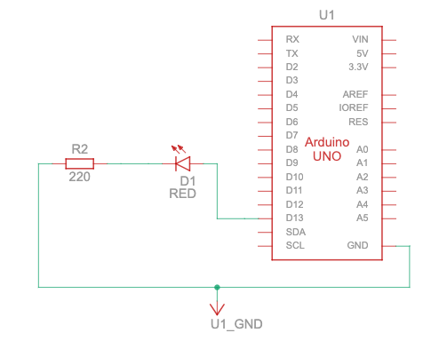
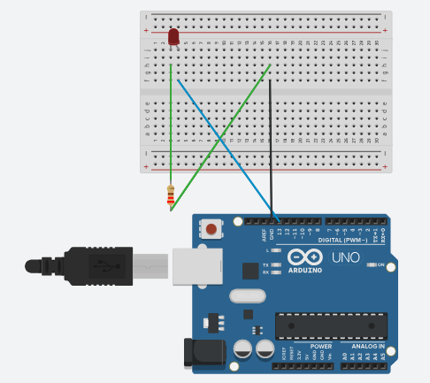

Oma likums. C++ datu tipi. Mirkšķināšana 
=================================================

Elektrotehnika
---------------------

**Oma likums:** 
  Elektriskā ķēdē :math:`I = U/R`, kur :math:`U` ir *spriegums* (piemēram, :math:`5~\text{V}` jeb 
  :math:`5` volti), 
  :math:`R` ir *pretestība* (piemēram, :math:`220~\Omega` jeb :math:`220` omi). Tad :math:`I` 
  ir *strāvas stiprums* (piemēram, :math:`I = 5/220` jeb :math:`0.023~\text{A}` jeb :math:`0.023`
  ampēri). 

**Citi Oma likuma varianti:** 
  Ja strāvas stiprums :math:`I` un pretestība :math:`R` ir zināmi, tad var atrast *potenciālu starpību* 
  jeb *sprieguma kritumu* uz šīs pretestības: :math:`U = IR`.
  Tas ir tas pats Oma likums, pierakstīts ar reizinājumu nevis dalījumu.
  Ja zināms spriegums un strāva, var atrast pretestību: :math:`R = U/I`.

**Piemērs 1:** 
  * Elektrisku ierīci ar diviem poliem, kura māk radīt noteiktu spriegumu jeb potenciālu starpību 
    (vienreizlietojama baterija ar :math:`1.5~\text{V}`, atkaluzlādējama baterija
    ar :math:`1.2~\text{V}` vai Arduino plate ar :math:`5~\text{V}`) sauc par *strāvas avotu*.
  * Elektrisku ierīci ar diviem izvadiem un fiksētu pretestību sauc par *rezistoru*. 
    (Komplektā ir rezistori ar pretestību :math:`220~\Omega`.)
  * Elektrisku ierīci ar diviem izvadiem, kurai vienā virzienā 
    ir ļoti maza pretestība, bet pretējā virzienā ir 
    ļoti liela pretestība (strāvu šajā virzienā cauri nelaiž) sauc par *diodi*.
    Dažas diodes izstaro gaismu - un tās tad sauc par gaismas diodēm 
    (jeb LED -- *light-emitting diode*). 

**Analoģija:**
  Ja iztēlojamies elektrisko strāvu kā ūdeni, tad:
  
  * *strāvas stiprums* (ampēri) līdzinās ūdens plūsmas ātrumam (piemēram, kubikmetri sekundē), 
  * *spriegums* (volti) līdzinās ūdenskrituma augstumam vai (slēgtā trubā) ūdens spiedienam.
  * Rezistors līdzinās trubas sašaurinājumam, caur kuru ūdenim grūtāk plūst cauri. 
  * Diode līdzinās vārstam, kurš laiž ūdeni cauri tikai vienā virzienā (un pretējā virzienā aizkrīt ciet).

  Elektriskā strāva vienmēr plūst no plusa (+) uz mīnusu (-). (Negatīvi lādētie elektroni strāvas vadiņos
  faktiski pārvietojas pretēji elektriskās strāvas virzienam.)

**Virknes slēgums:** 
  Ja virknē saslēdz divas pretestības :math:`R_1` un :math:`R_2` 
  (rezistorus, diodes vai jebko citu), tad kopīgā ķēdes pretestība ir :math:`R = R_1 + R_2`. 

**Piemērs 2:** 
  Pieņemsim, ka elektriskā ķēdē (ar kopīgo spriegumu :math:`5~\text{V}`) 
  ir virknē saslēgts viens rezistors un 
  viena gaismas diode ar nulles pretestību un maksimālo strāvas stiprumu  
  :math:`20~\text{mA}` (miliampēri) un ar sprieguma kritumu :math:`2~\text{V}`. 
  Atrast, kādai jābūt rezistora pretestībai, lai diode nepārsniegtu maksimālo strāvas stiprumu. 

**Atrisinājums:**
  Apzīmējam sprieguma kritumu uz diodes ar :math:`U_1 = 2~\text{V}` un
  sprieguma kritumu uz pretestības ar :math:`U_2`. Izpildās vienādība: :math:`U = U_1 + U_2`. 
  Tāpēc sprieguma kritums uz rezistora ir :math:`U_2 = 5~\text{V} - 2~\text{V} = 3~\text{V}`. 
  Dalām to ar maksimāli atļauto strāvu jeb :math:`20~\text{mA} = 0.020~\text{A}`. 
  Iegūstam :math:`R = U_2/I = 3/0.020 = 150~\Omega` jeb :math:`150` omi. 
  (Kastītēs atrodamās pretestības ir :math:`220` omi, bet arī tās var izmantot - strāva caur 
  diodi šajā gadījumā būs vēl mazāka.)

1.praktiskais darbs: Blink 
---------------------------------

**Vajadzīgās detaļas:**
  Arduino kontrolieris, USB vads (adapteris no USB-A uz USB-B).

1. Palaist Arduino IDE. Atvērt izvēlni **File > Examples > 01.Basics > Blink**. 
2. Izvilkt no kastītes kontrolieri un USB vadu. Vienu USB galu pievienot datoram, 
   otru galu pievienot Arduino kontrolierim. Pārliecināties, ka kontorlieris 
   ieslēdz diodi **ON**.
3. Uzstādīt kontroliera tipu un portu. Arduino IDE
   atvērt **Tools > Board > Arduino AVR Boards > Arduino Uno** un 
   arī **Tools > Port > usb.serial** (vai **Tools > Port > Com**, ja nav minēts USB).
4. Kompilēt programmiņu ar **Sketch > Verify/Compile**.
5. Nosūtīt programmiņu uz Arduino: **Sketch > Upload**. 
   Pārliecināties, ka lampiņa **L** (vēl viena diode uz Arduino plates) sāk mirkšķināt, 
   ik pēc sekundes ieslēdzoties vai izslēdzoties.

   .. literalinclude:: ../../sandbox/KalvisA/ControllerAlone/Blink/Blink.ino
      :language: cpp
      :linenos:

6. Izmainīt programmas 3., 8. un 10.rindiņā ``LED_BUILTIN`` ar skaitli 13. 

C++ datu tipi
--------------

Arduino skriptus parasti pieraksta valodā C++, bet failu vārdiem dod paplašinājumu ``.ino``.
Piemēram, skriptam ``Blink.ino`` ir jāatrodas direktorijā ``Blink\\Blink.ino``. 
Šie skripti nav pilnvērtīgas C++ programmas -- tām nav ``main()`` funkcijas, bet šos skriptus 
izsauc Arduino sistēma.

* ``int`` apzīmē veselu skaitli (pozitīvu, negatīvu vai nulli). Angliski ``integer`` ir *vesels skaitlis*. 
  Arduino programmās veseli skaitļi ir kontaktu numuri, gaidīšanas laiki milisekundēs u.c.
* ``float`` apzīmē daļskaitli. Sprieguma vērtības voltos parasti ir daļskaitļi. 
* C++ atļauj arī stringus (liek pēdiņās), ja jādrukā kādi paziņojumi uz datora seriālo portu. 
  Piemēram ``" (volti)"`` 

2.praktiskais darbs: Ārēja LED diode
---------------------------------------

Šajā darbā nemainīsim scenāriju, bet pievienosim ārēju diodi. 

.. list-table:: 
   :widths: 45 45
   :align: center
   :header-rows: 0

   * - |circuit01|
     - |circuit02|

1. Atvienot Arduino kontrolieri no USB vada. 
2. Saslēgt attēlā redzamo ķēdi. 
   **Uzmanību!** Pārliecinieties, ka diode un rezistors ir saslēgti virknē. 
   Tas ir veids, kā nepārsniegt maksimālo strāvas stiprumu uz ārējās 
   LED diodes.
3. Pievienot Arduino kontrolieri USB vadam. Pārliecināties, ka 
   tagad mirkšķinās gan mazā diode **L** uz Arduino plates, gan arī 
   F5 gaismas diode, kas piedalās mūsu ķēdē.

3.praktiskais darbs: Rakstīšana uz seriālo portu
--------------------------------------------------

1. Saslēgt ķēdi ar potenciometru sekojoši: 
   * Atvienot vadus no Arduino uz ārējo gaismas diodi LED,   
   * Potenciometra **GND** kontaktu savieno ar Arduino **GND**, 
   * Potenciometra **VCC** kontaktu savieno ar Arduino **5V**, 
   * Potenciometra **OTA** kontaktu savieno ar Arduino **A0**.

2. Izveidot jaunu skriptu 

   .. literalinclude:: ../../sandbox/KalvisA/PotentiometerHW233/ReadingValues/ReadingValues.ino
      :language: cpp
      :linenos:

3. Sakompilēt un nosūtīt šo skriptu uz Arduino. 
   Novērot strauju **RX** (seriālā porta) lampiņas mirkšķināšanu.

4. No Arduino IDE atvērt **Tools > Serial Monitor**. Pārliecināties, ka uz 
   datora ekrāna parādās skaitļi (veseli skaitļi no 0 līdz 1023 un arī voltu 
   vērtības no 0.0 līdz 5.0). Pārvietot potenciometra regulatoru un novērot 
   kā vērtības mainās. 

5. No Arduino IDE atvērt **Tools > Serial Plotter**. Arī pārvietot potenciometra 
   regulatoru un novērot kā mainās attēlotais grafiks. 

6. Izmainīt Arduino skripta kodu: Aizstāt tur esošajā izteiksmē 
   ``double valU = valInt * 5. / 1024`` skaitli ``5.`` ar vienkārši ``5`` (bez punkta beigās). 

7. No jauna atvērt **Tools > Serial Monitor** un novērot tur redzamās sprieguma vērtības. 
   Kādi skaitļi tur tagad parādās? Vai šīs vērtības ir pareizas?

Uzdevumi
------------

**Definīcija:** 
  Frekvenci (piemēram, mirkšķināšanas biežumu) mēra hercos. Piemēram, :math:`50~\text{Hz}` 
  jeb :math:`50` hercu frekvence nozīmē, ka kaut kas atkārtojas :math:`50` reizes sekundē. 

**1.uzdevums:**
  Daži cilvēki ir jūtīgi pret signāllampiņu mirkšķināšanu 
  noteiktās frekvencēs (`Photosensitive Epilepsy <https://en.wikipedia.org/wiki/Photosensitive_epilepsy>`_). 
  Īpaši problemātiskas ir :math:`15` līdz :math:`20` 
  hercu frekvences.  
  Kā jāizvēlas abi gaidīšanas laiki izsaukumos ``delay(milliseconds)``, lai 
  iegūtu šādu nekomfortablu diodes mirkšķināšanas frekvenci?
  Izmainiet Arduino skriptu ``BlinkF5.ino`` no 2.praktiskā darba, lai sarkanā diode 
  radītu šo frekvenci. 

**2.uzdevums:** 
  Izveidot ķēdi, kur gaismas diode sāk mirkšķināt tikai tad, kad
  potenciometrs ir aizbīdīts pāri pusei. To var pārbaudīt divos veidos: 

  * Skaitlis, ko nolasa no analogās ieejas A0 (``int valInt = analogRead(pinAnalog)``) ir virs 
    :math:`512` (t.i. pārsniedz :math:`1023/2` jeb pusi no maksimālās vērtības). 
  * *Potenciālu starpība* starp GND un OTA kontaktiem ir vismaz :math:`2.5~\text{V}`. 

  Jums var noderēt "if" operators. Piemēram, 

  .. code-block:: cpp

    if (valInt >= 512) {
        digitalWrite(ledPin, HIGH);   // Ieslēdz diodi
        delay(1000);                  // Gaida 1 sekundi
        digitalWrite(ledPin, LOW);    // Izslēdz diodi
        delay(1000);                  // Gaida 1 sekundi
    }
    else {
        digitalWrite(ledPin, LOW);    // Izslēdz diodi
        delay(1000);                  // Gaida 1 sekundi
    }

  Pabeigt šo skriptu. Saslēgt ķēdi tā, lai tajā būtu potenciometrs (starp GND un 5V kontaktiem), 
  kura izvads OTA raksta uz Arduino kontaktu A0. Pieslēgt arī LED diodi starp GND un D13 kontaktiem.
  (Faktiski -- sakombinēt 2. un 3. praktisko darbu).

**3.uzdevums:** 
  Vai ir iespējama tāda ķēde un Arduino skripts, kas ieslēdz diodi un pēc tam 
  maina uz tās padoto spriegumu ar potenciometru robežās no :math:`0~\text{V}` 
  līdz :math:`2~\text{V}`?

.. only:: Internal
  
  Rezistoru krāsas. https://www.blikai.com/blog/decoding-resistor-color-bands-a-beginner-s-guide
  https://www.blikai.com/blog/decoding-resistor-color-bands-a-beginner-s-guide
