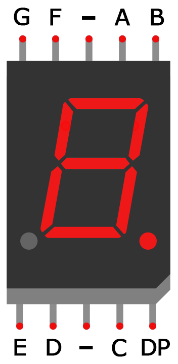
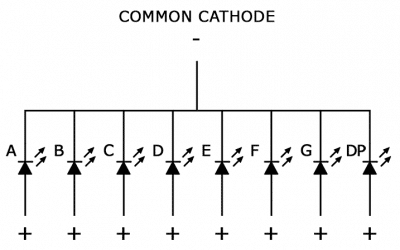

C++ zarošanās un cikli
======================================

* **if-else** komandas
* **for** cikla komanda
* **while** cikla komanda
* 7 segmentu LED displejs; kopīgais katods vai kopīgais anods

Zarošanās komanda "if"-"else"
--------------------------------

TODO

Cikla komanda "for"
--------------------

TODO

Piemērs: Morzes kods 
-----------------------

TODO

Piemērs: 7 segmentu LED displejs
----------------------------------

Šis piemērs ir pielāgots no 
`Arduino 7 segment display tutorial <https://www.circuitbasics.com/arduino-7-segment-display-tutorial/>`_. 

.. |segment_names| image:: figs/segment_names.png
   :width: 100px 
   :align: middle

.. list-table:: 
   :widths: 10 10 30
   :align: center
   :header-rows: 0

   * - |segment_names|
     - |7_segment_display|
     - |common_cathode|

.. list-table::
   :widths: 24 8 8 8 8 8 8 8 8 8 
   :header-rows: 0

   * - Displeja kontakts
     - A
     - B
     - C
     - D
     - E
     - F
     - G
     - DP
     - GND
   * - Arduino kontakts
     - 2
     - 3
     - 4
     - 5
     - 6
     - 7
     - 8
     - 9
     - GND

.. literalinclude:: ../../sandbox/KalvisA/LedDisplay5161AS/DisplayDigit/DisplayDigit.ino
   :language: cpp
   :linenos:
